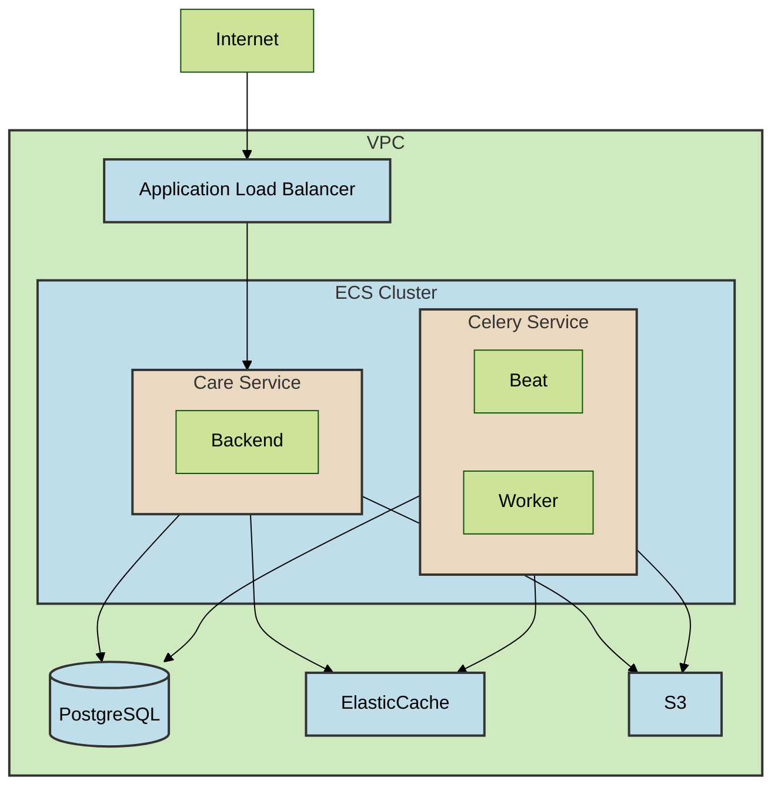
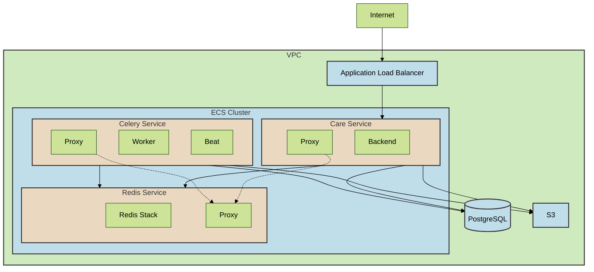

## Introduction

We use AWS ECS to run our staging instance of Care. The configuration of the deployment was straightforward: the ECS cluster hosts two services, Care and Celery (which runs both Beat and Worker), RDS for PostgreSQL as the database, and ElasticCache for Redis. We chose ECS to reduce costs and offload the management of services to AWS.




## The Problem

We recently switched from Little-Table to RediSearch for static, in-memory search (a story for another day). This required the RediSearch module to be loaded into Redis, which is not possible with AWS Elasticache due to the proprietary license of RediSearch. Therefore, we had to find a way to run our own Redis instance.

We chose ECS again for running the Redis instance but needed a method to connect the Care and Celery services to the Redis instance without exposing the service to the internet or adding complex configurations like an ALB, which seemed overkill for a simple service.


## The Solution

ECS Service Connect, Service Connect streamlines the process of service-to-service communication within Amazon ECS by integrating service discovery and a service mesh directly into Amazon ECS configurations. This integration allows for comprehensive management within each Amazon ECS service through deployments, offering a consistent method to reference services across namespaces independent of Amazon VPC DNS settings. Additionally, it provides uniform metrics and logs for monitoring applications on Amazon ECS. It is designed exclusively to connect services within Amazon ECS.


We started researching how to use it for our services. Service Connect, being a recent addition to AWS, had limited resources available, but the [launch video](https://www.youtube.com/watch?v=n6ghmEEjpNQ) of Service Connect was very helpful. It explains the feature and includes a demo on how to use it with ECS.


## The Implementation

The implementation of Service Connect is straightforward. First, we create a CloudMap namespace named `care-ns`. Then, we create a new task definition for Redis Stack:

```json
{
    "family": "redis-stack",
    "containerDefinitions": [
        {
            "name": "redis-stack",
            "image": "redis/redis-stack-server:latest",
            "portMappings": [
                {
                    "name": "redis",
                    "containerPort": 6379,
                    "hostPort": 6379,
                    "protocol": "tcp"
                }
            ],
            "essential": true,
        }
    ],
    "volumes": [],
    "networkMode": "awsvpc",
    "requiresCompatibilities": [
        "FARGATE"
    ],
    "memory": "3 GB",
    "cpu": "1 vCPU",
    "runtimePlatform": {
        "cpuArchitecture": "X86_64",
        "operatingSystemFamily": "LINUX"
    }
}

```

Note the portMappings; this is crucial as it allows the Service Connect proxy to work in server mode.

Then, create a new service called redis-stack using the Redis Stack task definition. Expand the Service Connect group and select **Turn on Service Connect**. For **Service Connect configuration**, select **Client and server**, then choose the namespace we created earlier. Add port mappings with the port alias `redis`, set the discovery name to `redis`, DNS to `redis.care-ns`, and port to `6379`. Now, click on Create Service.

Similarly, enable Service Connect for Care and Celery services, but select **Client side only** for **Service Connect configuration**, and choose the same `care-ns` namespace.

After setting the `REDIS_URL` environment variable to `redis://redis.care-ns:6379`, redeploy the Care and Celery services, and we are done.


## Result and Conclusion

The resulting architecture looked something like this:



Service Connect simplified the configuration and management, reducing the architecture's complexity. Regarding pricing, Service Connect is cost-effective as it uses AWS Cloud Map, which is free for ECS Service Connect, and the Service Connect proxy is billed alongside the Fargate task.

For more information, refer to the [official documentation](https://docs.aws.amazon.com/AmazonECS/latest/developerguide/service-connect.html).
