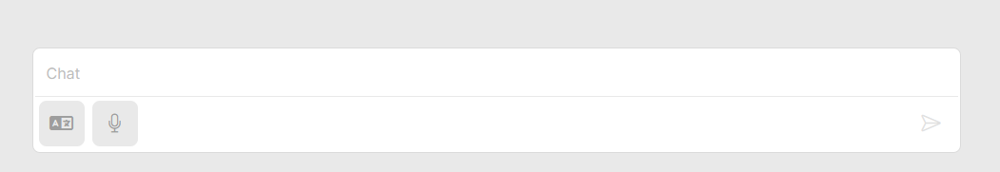

# Chat Interface

The chat interface is the core of the user experience in Ayushma, where users interact with the AI assistant through text or voice input and receive responses in either text or audio format.

<figure><figcaption></figcaption></figure>

### Chat Components

* **Input Box**: This is where users type their questions or prompts for the AI assistant. The input box can accept free-form text, allowing users to express their queries in natural language.
* **Send Button**: After typing their query, users click the send button to submit it to the AI assistant.
* **Microphone Button**: This button allows users to interact with Ayushma through voice input. Clicking the microphone button activates the speech-to-text functionality, enabling users to speak their questions or prompts.
* **Conversation History**: The chat history displays the ongoing conversation between the user and the AI assistant. Each message is presented with clear visual cues to differentiate user inputs and AI responses.
* **Language Selection**: Users can choose the language for both input and output. Ayushma supports multiple languages, allowing for communication in the user's preferred language.

### Chat Functionality

* **Text Input and Output**: Users can type their queries in the input box and receive text responses from the AI assistant. The responses are presented in a clear and readable format, often including relevant information, explanations, or suggestions.
* **Speech-to-Text**: The microphone button activates speech-to-text functionality, allowing users to speak their queries instead of typing. Ayushma converts the speech to text and processes it as a regular text input.
* **Text-to-Speech**: Ayushma can provide audio output for its responses. This feature is helpful for users who prefer to listen to information or have difficulty reading text.
* **Autoplay**: Users can enable or disable the autoplay function, which automatically plays the audio output of AI responses when available.
* **Reference Documents**: Ayushma might highlight reference documents used to generate responses. Users can click on these references to access the source material and gain deeper insights.

### Tips for Effective Chat Interaction

* **Clear and Concise Language**: Use simple and direct language to phrase your questions or prompts. This helps the AI assistant understand your intent accurately.
* **Specific Questions**: Ask specific questions rather than broad or open-ended ones. This allows Ayushma to provide more focused and relevant answers.
* **Provide Context**: If necessary, provide context or background information to help the AI assistant understand your query better.
* **Use Keywords**: Include relevant keywords in your queries to guide the AI assistant towards the information you're seeking.
* **Feedback**: Provide feedback on the AI assistant's responses, such as indicating whether they were helpful or not. This helps to improve Ayushma's performance over time.

### Supported Languages

Ayushma supports a variety of languages for both input and output, allowing users to interact with the AI assistant in their preferred language. The current list of supported languages includes:

* Bengali (বাংলা)
* English
* Gujarati (ગુજરાતી)
* Hindi (हिन्दी)
* Kannada (ಕನ್ನಡ)
* Malayalam (മലയാളം)
* Marathi (मराठी)
* Punjabi (ਪੰਜਾਬੀ)
* Tamil (தமிழ்)
* Telugu (తెలుగు)

Ayushma's language support is continuously expanding. Users can choose their desired language through the language selection option within the chat interface.
