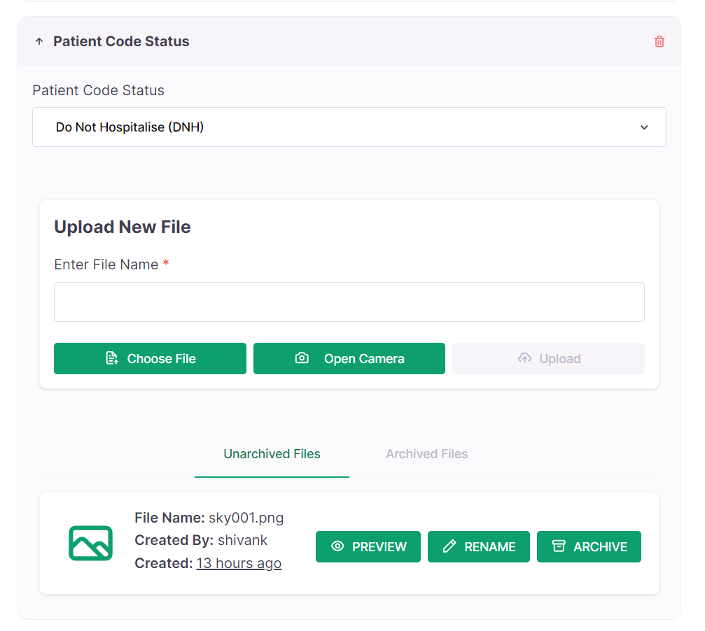
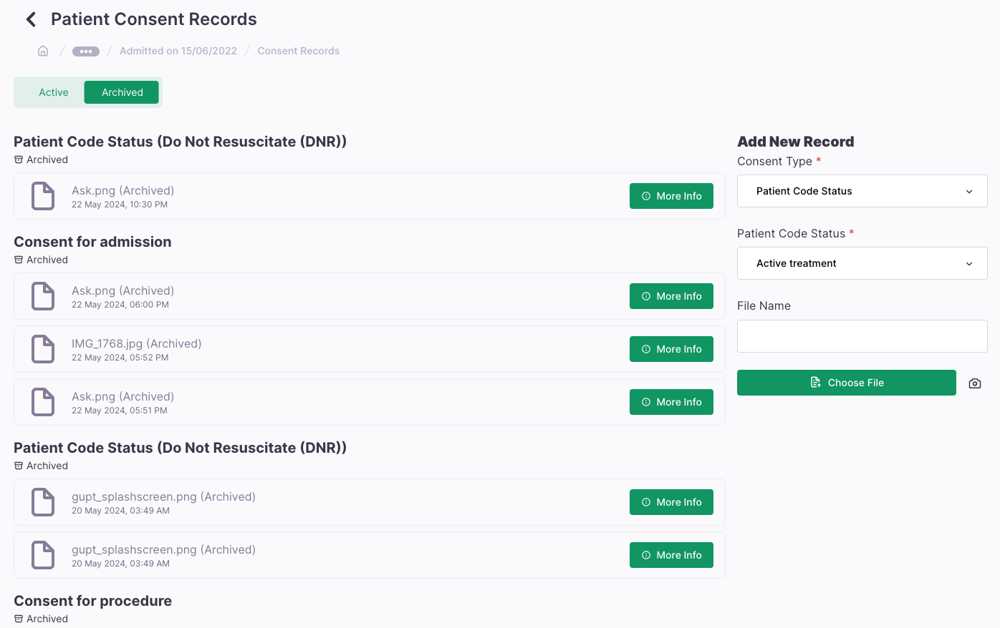

# CEP-6: Reimagining storing consents

## Preface

When consents were added to the patient consultation model, they were added based on the following assumptions:

- A patient (per consultation) can have multiple consents
- Each consent would have a type (e.g. consnent for admission, patient code status, consent for procedure)
- if type is patient code status, then the consent would have a sub type (e.g. DNR, DNH, Active Treatment)
- Each consent can have multiple files attached to it
- These files can be archived
- This form should be present in the consultation form

Looking at these requirements, a new JSON field was added to the patient consultation model with the following schema

```json
{
  "$schema": "http://json-schema.org/draft-07/schema#",
  "type": "array",
  "items": [
    {
      "type": "object",
      "properties": {
        "id": { "type": "string" },
        "type": { "type": "number" },
        "patient_code_status": { "type": "number" },
        "deleted": { "type": "boolean" }
      },
      "additionalProperties": false,
      "required": ["id", "type"]
    }
  ]
}
```

Our initial UI allowed consents groups to be made, and each consent group had its own file manager. Different file manager due to the fact that files were stored associative to the consent id, and there was already a file manager component that could be reused.



However, this did not have it's desired result on the field. Consents were not easily accessible and having a different file manager for each consent group was not intuitive.

The new requirement was to have a seperate page for consents, accessible from the patient consultation page.
In the consent page, files should be managed in a single file manager, and consents should be grouped by type.

The new UI requirement sounded more logical than the one I previously made, but the way I was handling consents in the backend were not compatible with this, thus hacks and workarounds were used to ship the new page, but it is clear that the current implementation is not sustainable.



## Proposal

We create a new model `PatientConsent`

```python
class PatientConsent(BaseModel):
    consultation = models.ForeignKey(Consultation, on_delete=models.CASCADE)
    type = models.IntegerField(choices=ConsentType.choices)
    patient_code_status = models.IntegerField(choices=PatientCodeStatus.choices, null=True, blank=True)
    archived = models.BooleanField(default=False)
    files = models.ManyToManyField(FileUpload, related_name="consents")
```

Alongside this, a constraint that does not allow a consent of `type` patient code status to have a null `patient_code_status`. We enforce this through the serializer as well.

Incase a new patient code status is added, the previous consent is automatically archived. A consent archive will also archive all files associated with it.

`BaseModel` handles creator, editor and time stamps.

New APIs for CRUD operations on `PatientConsent`

```
{consultation_id}/patient-consents/
```

We fetch files by filtering on the `associating_id` field.

```
/files/?file_type=CONSENT_RECORDS&associating_id=patient-consent-12345
```

But this would need to fetch multiple times from the client for each consent, thus we update the `associating_id` filter to accept multiple ids.

```
/files/?file_type=CONSENT_RECORDS&associating_id=patient-consent-12345,patient-consent-12346
```

So on the client side, we first fetch the consents, and then fetch the files, and then group them.

If a new patient code status is needed, we archive the consent through a `PATCH` request, which triggers a cascade archive of the files.
