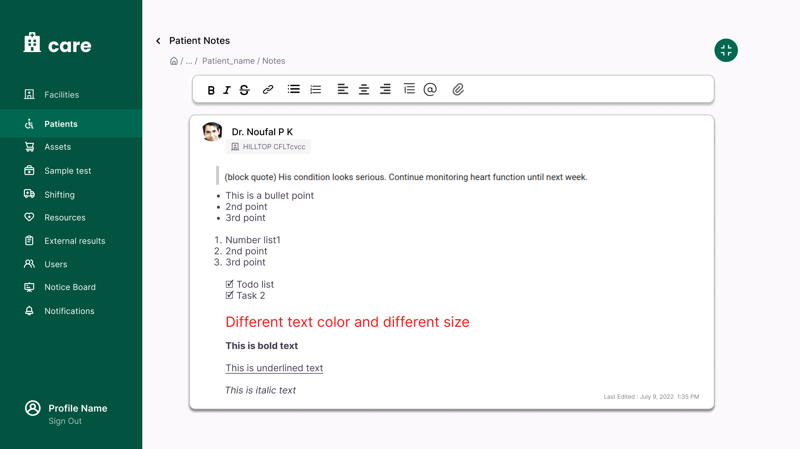

# GSoC Proposal

## Project Title: Doctor Notes Enhanchement

### Project Overview

This project aims to enhance the functionality of doctor notes within the system to provide a more comprehensive and user-friendly experience. The planned features aim to empower users by allowing them to upload images, hyperlink documents, and leverage markdown formatting for better organization and clarity. The key enhancements include implementing a file upload option, adding markdown support, enabling notes to be directed to specific files, and introducing a user tagging mechanism for improved communication. Additionally, all uploaded files will be seamlessly integrated into the patient consultation file, enhancing the overall efficiency and effectiveness of healthcare documentation.

### Proposed Solution and Benefits to Users

1. **File Upload Option**: Users can upload different types of files, like images, documents, audio, and videos, directly to doctor notes. This helps make documenting easier and makes patient records more detailed. It helps doctors make better decisions about patient care.

2. **Markdown Support**: Users can use markdown to format their notes better. This helps them organize information clearly and makes it easier for medical teams to work together. It leads to better care for patients.

3. **Comments under Each Note**: Users will have the ability to add comments under each note, allowing for better organization and collaboration. This feature enhances the overall usability of the system and improves communication among healthcare professionals.

4. **User Tagging Mechanism**: Users can tag other healthcare professionals in their notes. This helps them communicate better and work together efficiently. Users will get notifications when they're mentioned in notes or comments. This encourages quick responses and active collaboration.

5. **Integration with Patient Consultation Files**: All uploaded files will be added to the patient consultation file in a section called "Doctor Notes." This makes it easy to find relevant information quickly. It helps doctors make informed decisions about patient care.

6. **Bookmark Feature**: A new bookmark feature will be introduced, allowing users to bookmark important notes or sections for quick access. This feature can be seamlessly integrated across various sections of the website, ensuring its versatility and enhancing user convenience and productivity.

## Week-Wise Timeline

### Community Bonding Period (May 1 - May 26)

- Discussing with mentors about the project and making changes according to suggestions.

### Week 1 (May 27 - June 2)

- Resizable Sidebar view implementation.

### Week 2-4 (June 3 - June 23)

- Markdown editor.
- Embed support (for links, files).

### Week 5-6 (June 24 - July 7)

- Making necessary changes in the backend for comments support, linking attachments, and tagged fields.
- Developing backend for new bookmark feature.

<!-- ### Mid Term Evaluation (July 8 - July 12) -->

### Week 7-8 (July 8 - July 21)

- File, camera capture, audio upload support.
- File preview support for attachments using existing file preview components (images, audio, pdf, excel files).
- Attachment download support.
- Doctor connect feature in notes view.

### Week 9-11 (July 22 - Aug 11)

- Tagging support for users, others' notes, inline attachments.
- Notification support.
- Redirect to specific comment on clicking on notification.
- Bookmark support.

### Week 12-13 (Aug 12 - Aug 25)

- Embed preview.
- Copy-paste support for images to upload.
- Drag and drop functionality for file.
- Minor enhancements integrating all features.

---

## About Lexical

Lexical is a modern, highly customizable, and extensible text editor library that provides a high level of control over the editor's behavior and output. It supports a variety of features required for this project, including:

- Mentions
- Embeds
- Inline attachments
- Markdown support

### Advantages of Lexical

- **Customizability**: Allows for creating custom components for different text styles and embedding various content types.
- **Performance**: Optimized for performance, making it suitable for complex applications.
- **Extensibility**: Supports a wide range of plugins and extensions, enabling additional functionalities like emoji pickers and file uploads.

LexicalComposer provides access to the underlying LexicalEditor instance via React Context:

  ```javascript
    export function MyLexicalPlugin(props) {
        const [editor] = useLexicalComposerContext();
        ...
    }
  ```

# Initial Implementation Plan

Figma link: [Doctor Notes Enhanchement](https://www.figma.com/design/UJr4NYBuPyakHlXlcB3zMc/Uday---GSoC-2024?node-id=4328-955&t=d7yx6U0wVmreAOmG-0)

## Resizable Sidebar View Implementation

- Implementing a resizable sidebar view for doctor notes.
- Ensuring the sidebar's state is saved in local storage.

  ```javascript
  // DoctorNotesSidebarView.tsx
  import { useState, useEffect } from "react";

  const Sidebar = () => {
    const [width, setWidth] = useState(
      localStorage.getItem("doctor-notes-sidebarWidth") || 250
    );

    const handleResize = (e) => {
      setWidth(e.clientX);
    };

    useEffect(() => {
      localStorage.setItem("doctor-notes-sidebarWidth", width);
    }, [width]);

    return (
      <div onMouseMove={handleResize} className={`... w-${width}`}>
        {/* Sidebar content */}
      </div>
    );
  };

  export default Sidebar;
  ```

## Markdown Editor using Lexical

- Integrate Lexical for the markdown editor.
- Add support for embedding links and files.

  ```javascript
  // RichTextEditor.tsx
  import { LexicalComposer } from '@lexical/react/LexicalComposer';
  import { RichTextPlugin } from '@lexical/react/LexicalRichTextPlugin';
  import { HistoryPlugin } from '@lexical/react/LexicalHistoryPlugin';
  import { LinkPlugin } from '@lexical/react/LexicalLinkPlugin';
  import { FileUploadPlugin } from './plugins/FileUploadPlugin'; // Custom plugin for file uploads
  import { $convertFromMarkdownString, $convertToMarkdownString, TRANSFORMERS } from '@lexical/markdown';

  const MarkdownEditor = ({
    onChange,
    initialValue,
  }) => (

    const editorConfig = {
      // theme: Theme,
      // editable: false,
      editorState: () => $convertFromMarkdownString(initialValue || '', TRANSFORMERS)
    };

    <LexicalComposer initialConfig={editorConfig}>
      <RichTextPlugin />
      <HistoryPlugin />
      <LinkPlugin />
      <FileUploadPlugin />
      <MentionPlugin />
      <OnChangePlugin onChange={
        (editorState) => {
          editorState.read(() => {
            const markdown = editorState.read(() => $convertToMarkdownString(TRANSFORMERS));
            onChange(markdown);
          });
        }
      } />
    </LexicalComposer>
  );

  export default MarkdownEditor;
  ```

### Mockups


## Embed Support

We can perform onPaste( ) actions by matching a specific regular expression
(regex) and display custom components.

  ```javascript
  const url = "https://care.ohc.network/facility/997c7f30-8e2f-4d62-8b58-2a8771e658d6";
  const regex =/https:\\/\\/care\\.ohc\\.network\\/facility\\/([0-9a-fA-F]+(?:-[0-9a-fA-F]+)+)/;
  const match = url.match(regex);
  if (match) {
    const facilityId = match[1];
    //fetch data and display component by appending to the the editor object
  } else {
    //display as a link with hyperlink support (custom component)
  }
  ```

## Initial Backend plan:

[View on Eraser](https://app.eraser.io/workspace/fiQRBVedxyexprtDl2Nv?elements=vXbJoDSB0HW1lsAc36lyuw)

## Attachments / File upload
- Since doctor notes are specific to a consultation, I will be attaching files directly to patient consultations with the associating ID as notesId.

**Backend:**

- A new file type will be added to the existing FileType enum.

  ```python
  class FileType(enum.Enum):
      ...
      NOTES = 8
  ```

**Frontend:**

Uploading attachments to specific comment: POST : `/api/v1/files/`
- We can use notes Id as associating id for uploading attachments , which later helps in easy retrieval by using following method
  
  ```javascript
    await request(routes.createUpload, {
      body: {
         file_type: "NOTES",
         associating_id: `${noteId}`,
         ...
    }, });

    //database : FileUpload model
    {
      "associating_id": `${noteId}`,
      "signed_url": `${S3 signed URL}`,
      ...
    }
  ```

<!-- ## Mentions/Tagging support -->

## Notifications for user tagging

**Backend:**
- A new event type `USER_TAGGED` will be added in the notification model.
  
  ```python
  class Event(enum.Enum):
        ...
        PATIENT_NOTE_ADDED = 210
        USER_TAGGED = 230
  ```
- A new notification will be created when a user is tagged in a note.
  ```python
  NotificationGenerator(
        event=Notification.Event.USER_TAGGED,
        caused_by=self.request.user,
        caused_object=instance,
        facility=patient.facility,
        users_tagged=instance.tagged_users.all(),
    ).generate()
  ```
- Modifications in the notification handler to retrieve a message for tagged users.
    
    ```python
    def generate_system_message(self):
      message = ""
      ...
      elif isinstance(self.caused_object, PatientNotes):
          if self.event == Notification.Event.PATIENT_NOTE_ADDED.value:
              message = "Notes for Patient {} was added by {}".format(
                  self.caused_object.patient.name,
                  self.caused_by.get_full_name(),
              )
          elif self.event == Notification.Event.USER_TAGGED.value:
              message = "{} just mentioned you in a note for Patient {}".format(
                  self.caused_by.get_full_name(), self.caused_object.patient.name
              )
      return message
    ```
- Adding users to send notifications.
    
    ```python
    def generate_system_users(self):
      users = []
      users_tagged = self.users_tagged
      ...
      if users_tagged:
          users.append(users_tagged)
      return users
    ```