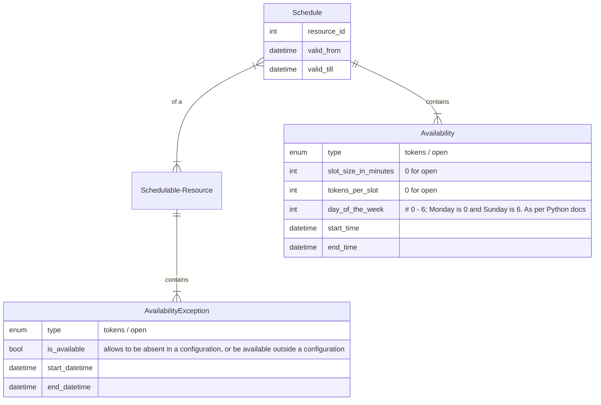
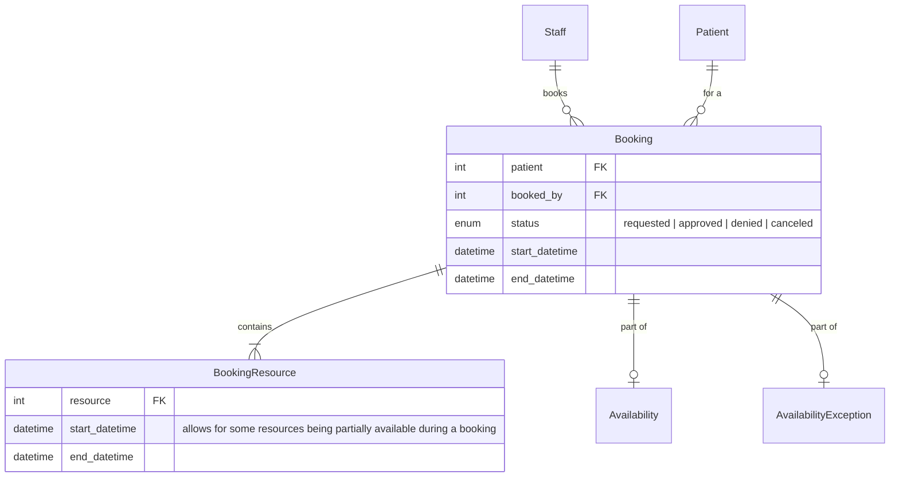
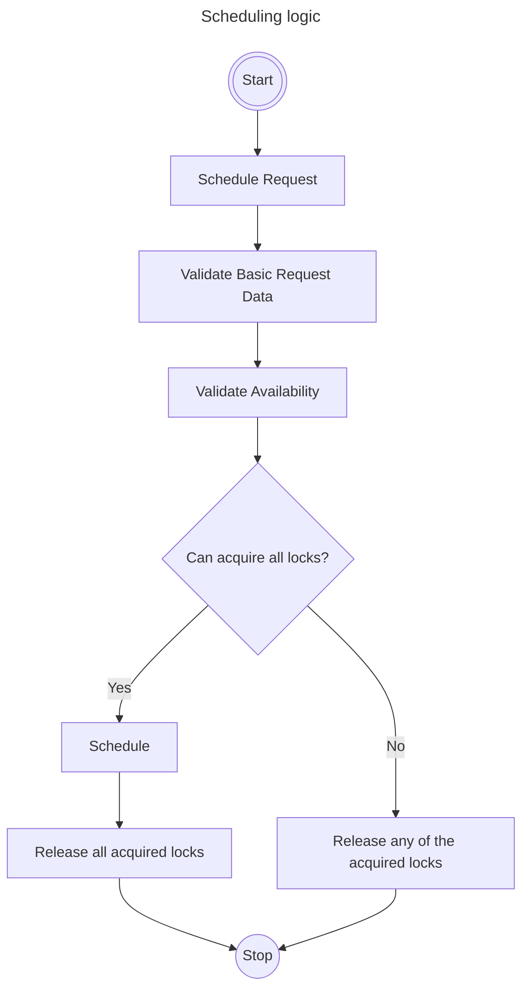
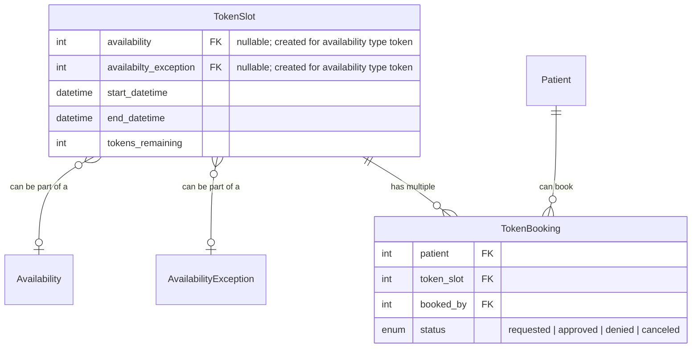

# CEP-7: Scheduling in CARE

### Motive

Care is being used in different healthcare environments for various use-cases, including consultation scheduling, OT scheduling, vaccination appointment scheduling, and other appointment management needs. A robust and flexible scheduling system is essential for efficient healthcare delivery and resource management.

### Requirements

### 1. Appointment Booking

- The system shall allow staff members to book appointments for patients.
- Appointments can be scheduled for future dates or as walk-ins for the current day.
- The system shall support different appointment types, including:
  - New patient appointments
  - Follow-up appointments
- The system shall allow doctors to specify days for specific appointment types (e.g., follow-ups only on certain days).
- Appointments may include multiple participants or be linked to other objects. For example, a procedure could be an object with a team associated with it, and the team would consist of the participants involved in the appointment.
- Future Scope: The system shall provide a public-facing webpage where users can book their own appointments.

### 2. Resource Management

- Doctors shall be considered as schedulable resources within the system.
- Doctors shall have the ability to manage their own schedules.
- The system shall allow authorized staff members to manage doctors' schedules on their behalf.
- The system shall support flexible scheduling options, including:
  - Fixed slot durations (e.g., 15-minute intervals)
  - Daily patient limits (e.g., maximum of 20 patients per day)

### 3. Availability Management

- The system shall have the capability to show availability of resources (doctors, rooms, equipment, etc.).
- Doctors shall be able to set their available days and times.
- Doctors shall have the option to mark certain periods as unavailable.
- Doctors shall be able to specify which days in the future they can be booked.
- The system shall respect all availability settings when allowing appointments to be booked.
- The system shall support recurring availability patterns (e.g., available every Monday and Wednesday, 9 AM to 5 PM).
- Authorized staff members shall be able to view and modify availability settings on behalf of doctors, subject to appropriate permissions.

### 4. Check-in and Encounter Management

- The system shall provide a check-in function for when patients arrive at the facility.
- An encounter shall only be created in the system upon patient check-in.
- The system shall automatically manage a token system for patient queuing. (mix of appointments + walk-ins) [Logic is an open challenge to be tackled with Roopak]
- The system shall implement a check-in based priority system that automatically manages appointments and walk-ins.
- The check-in process shall update the patient's queue position based on their appointment time and arrival time.

### 5. Priority Management

- The system shall support different levels of patient priority.
- Staff shall have the ability to prioritize a VIP patient in the queue.
- The system shall provide clear visibility of the current queue order to staff members.
- The priority management system shall be flexible enough to accommodate emergency situations.

### 6. Appointment Statuses

- The system shall support multiple statuses for scheduled visits, including but not limited to:
  - Scheduled
  - Checked In
  - In Progress
  - Completed
  - Cancelled
  - No Show
- The system shall allow for status updates throughout the appointment lifecycle.

### 7. Location-based Scheduling

- The system shall support the registration and booking of various locations, including but not limited to Operating Theaters.
- This implementation shall be generic, allowing extension to support other types of location-based scheduling (e.g., vaccination appointment scheduling).
- Users with appropriate access rights shall be able to book locations.
- Location schedules shall be manageable by designated managers (can be the owner of the location schedule).
- The system shall support the handling of emergency cases that may affect location schedules.

### 8. User Permissions

- The system shall implement role-based access control for scheduling functions.
- Specific permissions shall be required for managing doctors' schedules on their behalf.
- Location booking shall be restricted to authorized doctors and staff members.

### 9. Flexibility and Customization

- The system shall allow for customization of appointment durations based on doctor or appointment type preferences.
- The system shall support different scheduling rules for different departments or specialties.

### 10. Notifications

- The system shall send notifications to relevant staff members for schedule changes, new bookings, and cancellations.
- Future: Allow SMS and whatsapp confirmations for patients

### 11. Audit Trail

- The system shall maintain a comprehensive audit trail of all scheduling actions, including creations, modifications, and cancellations.
- It shall support comments that can be added by users with access to the object.

### 12. Future Beckn Integration

- The architecture shall be flexible enough to accommodate Beckn protocols and standards for interoperable scheduling.


## Backend Design

### Design Thesis

Each resource - be it doctor, OT, any other facility, including consultation room - will be bookable and have their respective availability charts.

### Availability and Scheduling
- Make booking and schedule agnostic to business logic.
- Use a factory model design to add specific business logic.

### Live Queue
- Live Queue will follow a priority score system → a score will be assigned to every booking, depending on multiple factors, and a simple sort on this should allow live queue

## Models

### Availability
All resources which can be scheduled shall have an entry into the `SchedulableResource` model. It will be linked back to the original object as well

The availability of a resource will be stored using 3 models - `Schedule`, `Availability` and `AvailabilityException`.

The `Schedule` will be created each time a new configuration is added. When a new configuration is setup, the old one is invalidated by setting the `valid_till` and creating a new configuration.




:::warning[Availability as a separate service]
Availability shall be written as a separate service, and all data access should be driven through the service alone. Direct calls to the models should not be allowed. We can achieve this through reviews and try using pre-commit hooks.
:::

### Booking

:::warning DB level constraints to avoid overbooking
DB level constraint shall be added to `BookingResource` table, which will check if the resource is being used in another `Booking`
:::



### Dynamic booking vs Slot based booking

:::info
Generating slots based on availability was one of the first ideas which was discussed. It required a cron job and an asynchronous task to generate slot and handle changes to configuration. 

It was then decided to proceed with a dynamic booking approach as it required less infrastructure and the scale was not identified to be so much. The dynamic mechanism discussed below will use DB row level locking and table based locking mechanism to avoid cross booking.
:::

**Implementing locking**

- Locking will be implemented using Redis locks. 
- All locks to have a maximum of 1 min of TTL. This is to avoid holding of locks even if the API crashes.




### Token Booking
Token booking and Booking needs to be handled seperately as Booking of resources needs to override the tokens booked. 




**Sample Algorithm**


## Operations
Following are the operations allowed on the Availability Service
- Add / Update Availability
  - For doctors, admin, other staff members
  - Permissions, delegations need to be handled. 
  - We can consider a delegation framework.
- Get Schedule
- Lists the availability
- Check Availability
- Check availability during a time slot ?
- Schedule
  - Request for a schedule
  - Helps to handle requests from the public.
  - Book a schedule
  - Either approve a request or create a new one. 
- Approval, Creating an approved schedule to be handled based on permissions.


## Example

:::info Example
Dr. Roopak is available in weekdays Mon-Fri 
in the hospital from 10 am to 5 pm, and a lunch break from 1 pm to 2 pm.
He is open for OP during 10 am to 12 pm.
On Oct 25, Friday he is unavailable. He will compensate for that on Oct 28.
:::

```py
Schedule:
  resource: Doctor Roopak
  valid_from: Oct 1, 2024
  valid_till: Oct 31, 2024

Availability / 1
  type: "tokens"
  slot_size_in_minutes: 30
  tokens_per_slot: 10
  day_of_the_week: Mon
  start_time: 10 am
  end_time: 12 pm

Availability / 2
  type: "open"
  slot_size_in_minutes: None
  tokens_per_slot: None
  day_of_the_week: Mon
  start_time: 12 pm
  end_time: 1 pm

Availability / 3
  type: "open"
  day_of_the_week: Mon
  start_time: 2 pm
  end_time: 5 pm

AvailabilityException / 1
  type: "open"
  is_available: false
  start_datetime: Oct 25, 2024 10 am 
  end_datetime: Oct 26, 2024 9 pm

AvailabilityException / 2
  type: "token"
  is_available: true
  start_datetime: Oct 28, 2024 10 am 
  end_datetime: Oct 28, 2024 12 pm

AvailabilityException / 3
  type: "open"
  is_available: true
  start_datetime: Oct 28, 2024 2 am 
  end_datetime: Oct 28, 2024 5 pm
```

**He is operating on a patient on Oct 11 2 pm to 4 pm.**

```py
Booking:
  patient
  start_datetime: Oct 11 2 pm
  end_datetime: Oct 11 4 pm
  booked_by: Staff ID
  status: approved

BookingResource:
  resource: Dr. Roopak
  start_datetime: Oct 11 2 pm
  end_datetime: Oct 11 4 pm
```

**2 people need tokens for his OP on 20 Oct 10 - 10:30**
```
TokenSlot
  availabilty_id
  start_datetime 20 Oct 10 am
  end_datetime 20 Oct 10:30 am
  tokens_remaining 8

TokenBooking
  patient: Patient 1
  token_slot_id
  booked_by: FK to Object - Patient, Staff
  status: approved

TokenBooking
  patient: Patient 2
  token_slot_id
  booked_by: FK to Object - Patient, Staff
  status: approved
```
