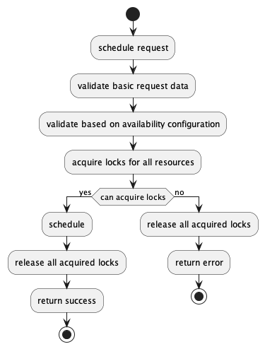

# Backend Design

## Design Thesis

Each resource - be it doctor, OT, any other facility, including consultation room - will be bookable and have their respective availability charts.

### Availability and Scheduling
- Make booking and schedule agnostic to business logic.
- Use a factory model design to add specific business logic.

### Live Queue
- Live Queue will follow a priority score system → a score will be assigned to every booking, depending on multiple factors, and a simple sort on this should allow live queue

## Models

### Availability
All resources which can be scheduled shall have an entry into the `SchedulableResource` model. It will be linked back to the original object as well
```py
class SchedulableResource: 
	id: int
	type: enum - "doctor" | "ot" | "lab" | "consultation_room"

    object_id: int # use actual id of the object. 
```

The availability of a resource will be stored using 3 models - `AvailabilityConfiguration`, `Availability` and `AvailabilityException`.

The `AvailabilityConfiguration` will be created each time a new configuration is added. When a new configuration is setup, the old one is invalidated by setting the `valid_till` and creating a new configuration.

```py
class AvailabilityConfiguration:
	resource_id: int # foreign key to SchedulableResource
	valid_from: datetime
	valid_till: datetime
	slot_size_in_minutes: int # number of minutes in a slot
	tokens_per_slot: int # for OT, Rooms, it will be 1, but for doctors, it can be 10 tokens per 30 minutes, etc.

class Availability:
	configuration_id: int # fk to AvailabilityConfiguration
	# can have more than one entry for the same day to support 10-12 and 2-4
	day_of_the_week: int # 0 - 6; Monday is 0 and Sunday is 6. As per Python documentation https://docs.python.org/3/library/datetime.html#datetime.datetime.weekday
	start_time: time
	end_time
	
class AvailabilityException:
	resource_id: int 
	
	is_avaiable: bool 
    # exception can be being available on a non-configured day, 
	# as well as being not-available on a configured day
	
	start_datetime
	end_datetime
	reason # [optional] national holiday, doctor on leave, etc.
```

:::warning[Availability as a separate service]
Availability shall be written as a separate service, and all data access should be driven through the service alone. Direct calls to the models should not be allowed. We can achieve this through reviews and try using pre-commit hooks.
:::

### Booking
```py
class Booking:
	patient_id
	start_datetime
	end_datetime
	booked_by
	status: enum "requested" | "approved" | "denied" | "canceled"
	status_message: str #  to be used in case requested bookings were denied, or canceled.
	
	resources_used: list[BookingResource] # one to many relation with BookingResources
	resources_used_json: json # processed json - only for read

class BookingResource:
	booking_id
	resource_id
	
	# separate datetime allows for the provision of some doctors 
	# being available only for the first few minutes / hours. 
	start_datetime
	end_datetime
```

### Dynamic booking vs Slot based booking

:::info
Generating slots based on availability was one of the first ideas which was discussed. It required a cron job and an asynchronous task to generate slot and handle changes to configuration. 

It was then decided to proceed with a dynamic booking approach as it required less infrastructure and the scale was not identified to be so much. The dynamic mechanism discussed below will use DB row level locking and table based locking mechanism to avoid cross booking.
:::

**Implementing DB based locking**

```py
class ScheduleLock:
	resource_id:
	is_locked: boolean
	locked_at: nullable timestamp
```



:::note
A resource is schedulable if the `is_locked` is `False` OR `is_locked` is `True` but `locked_at` timestamp is older than 1 minute. The 1 minute is the timeframe within which the resource scheduling should be completed by the API.
:::

#### Sample algorithm for Booking
```py
for resource in resources:
           ResourceLock.objects.get_or_create(
               resource_id=resource.id,
               defaults={
                   "is_locked": False,
                   "locked_at": None,
               },
           )
           
       try:
           with transaction.atomic():
               resources_to_lock = (
                   ResourceLock.objects.filter(
                       resource_id__in=resource_ids_to_lock,
                   )
                   .filter(
                       Q(is_locked=False)
                       | Q(
                           is_locked=True,
                           locked_at__lt=timezone.now() - timedelta(minutes=1),
                       )
                   )
                   .select_for_update(nowait=True, skip_locked=False)
               )
               if resources_to_lock.count() != len(resource_ids_to_lock):
                   raise ValueError("Resource is locked.")
               resources_to_lock.update(is_locked=True, locked_at=timezone.now()
               )
       except ValueError:
           raise Exception(“select_for_update failed”)
```

## Operations
Following are the operations allowed on the Availability Service
- Add / Update Availability
  - For doctors, admin, other staff members
  - Permissions, delegations need to be handled. 
  - We can consider a delegation framework.
- Get Schedule
- Lists the availability
- Check Availability
- Check availability during a time slot ?
- Schedule
  - Request for a schedule
  - Helps to handle requests from the public.
  - Book a schedule
  - Either approve a request or create a new one. 
- Approval, Creating an approved schedule to be handled based on permissions.

