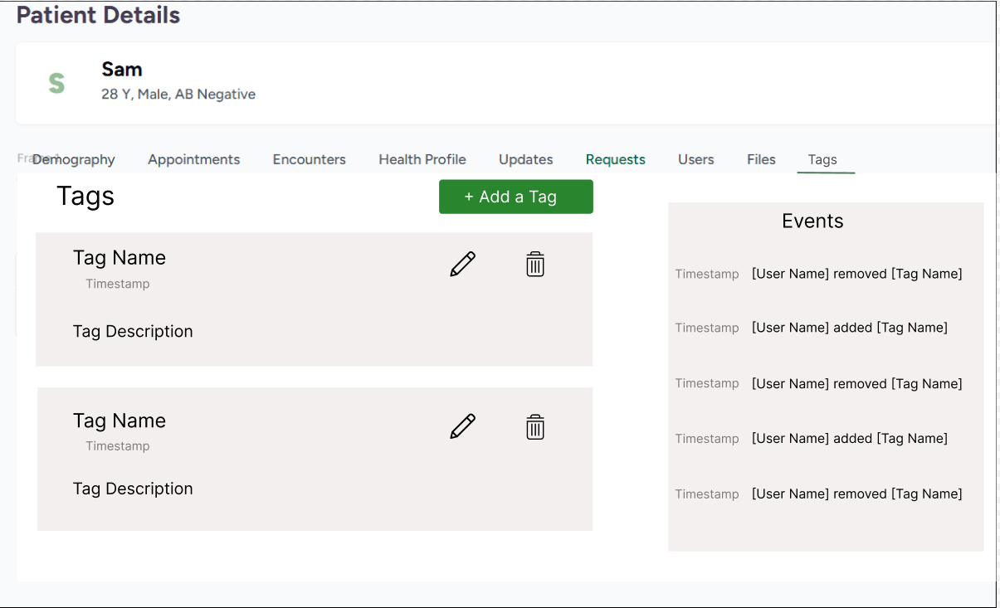
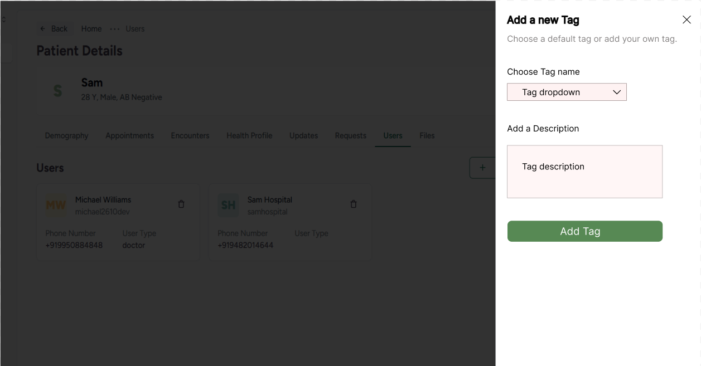
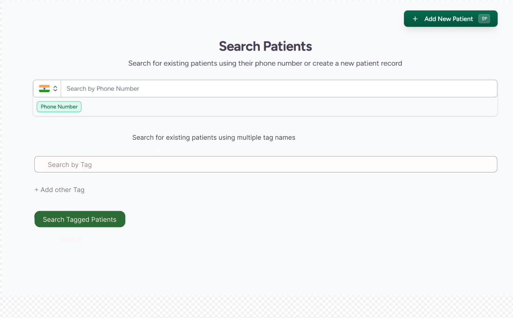

# CEP-11: Patient Tagging System in CARE

### Motive

Care is being used in various healthcare environments for managing patient information and care delivery. A flexible and robust patient tagging system is essential for efficient patient categorization, filtering, and management. This system will enable healthcare providers to quickly identify patients with specific characteristics, conditions, or care requirements, enhancing the overall quality of care and operational efficiency.

### Requirements

### 1. Tag Creation and Management

- The system shall allow authorized users (nurses and doctors) to create tags at the facility level.
- Tags shall have a name and an optional description.
- Tags shall be unique within a facility.
- The system shall provide functionality to edit and delete existing tags.

### 2. Tag Assignment

- Authorized users shall be able to assign tags to patients.
- Multiple tags can be assigned to a single patient.
- The system shall maintain a log of tag assignments and removals, including the user who performed the action and the timestamp in event logs.

### 3. Tag Visibility and Access Control

- Tags shall be visible on the patient's profile.
- Tags shall be facility-specific and not visible to other facilities.

### 4. Filtering and Searching

- The system shall provide functionality to filter patients by one or multiple tags.
- Advanced search capabilities shall be implemented to find patients with specific tag combinations.

### 5. Customization and Extensibility

- Care should have a default set of tags instance level.
- Instance admins should be able able to seed tags instance level.
- The system shall allow for custom tag attributes to be defined at the facility level.
- The architecture shall be flexible to allow future extensions, such as automated tag assignment based on clinical data.

## Implementation Approach

### Proposed Backend Changes

To start with the Backend Implementation a new model named Tag must be introduced which would inherit the existing EMRBaseModel with fields such as:

- **Name** (CharField)
- **Description** (TextField)
- **Patient** (ForeignKey referencing to the existing Patient model)
- **Facility** (ForeignKey referencing to the existing Facility model)

#### Changes to the PatientViewset
Changes to the existing pydantic_read_model and pydantic_retreive_model in the existing PatientViewset can be made by filtering out the tags associated with the patient in a particular facility and then serialize to json format and send as a response to the frontend.

#### Implementation of New viewset for tags
Creating a PatientTagViewset which would inherit the EMRBaseViewset and all EMR related mixins. Seperate pydantic models for creating, updating and listing patient tags can be defined. 

#### Implementation of Authorization
Allowing authorized users, particularly Doctor and Nurse, to create, edit and delete tags. The viewset can handle this authorization by overriding the authorize_create and authorize_update methods from the mixins.

#### Tags Visibility and Access control
The viewset would include a method which would raise a permission denied exception for the doctor and nurses of other facility trying to make a request for accessing the tags of a patient.

#### Event logs support
The model would support soft delete of tags only. This would keep the logs of all the tag assignments, updates and removals made by doctors and nurses along with the information of modified_date and updated_by fields provided by the existing EMRBaseModel and BaseModel respectively. The tags in the event logs can be sorted by modified_date to show the recent log first. 

#### Filtering Patients
A seperate filterset class can be made to filter the patient based on tag name. Also filtering the patients with two tag combinations by overriding the methods of filterset class to adjust the filter logic.

#### Customizability
Creating a new model DefaultTagset with fields 
- **Name** (CharField)
- **DefaultDescription** (TextField)
- **Facility** (ForeignKey referencing to the existing Facility model) 

which provides admins to add default tagset based on the clinical needs at Facility level   

### Mockups for Frontend Changes

#### Mock Template for Tags Display

The Tags tab in the Patient details page would have all the tags along with the description. It would also have an Events section which would display 5 most recent event logs of added,removed tags. It would also have a button for adding a tag. All the tags would have edit and delete options.

#### Mock Template for Add/Edit Tag

When the User would click on "+Add a Tag" button or edit tag icon in the Patient Details page, the above form would pop from right side. This form would contain a search and select dropdown for Tag Name where the user can either select from the default tagset or can enter a custom tag name along with an optional description.

#### Mock Template for Search Patients page

The Search Patients functionality can be extended by providing advanced search option of searching the patients by single or multiple tag combinations.