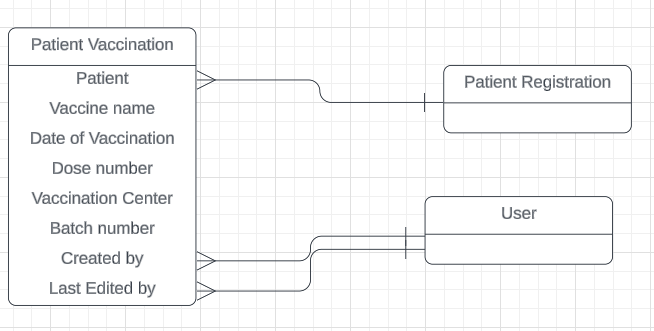
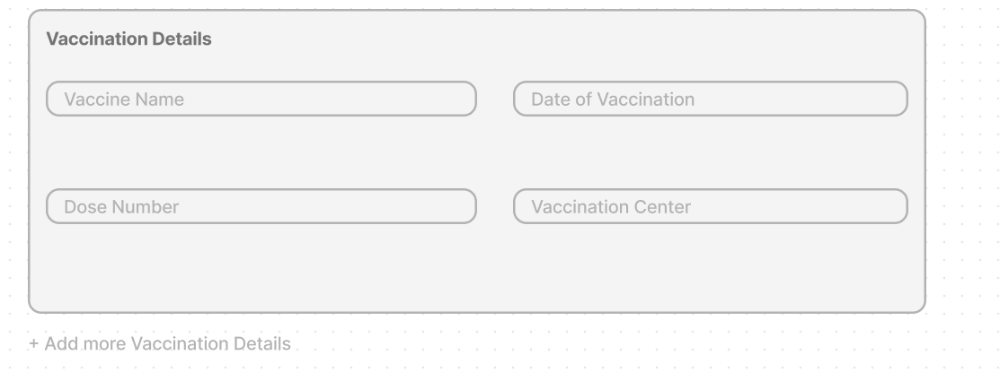
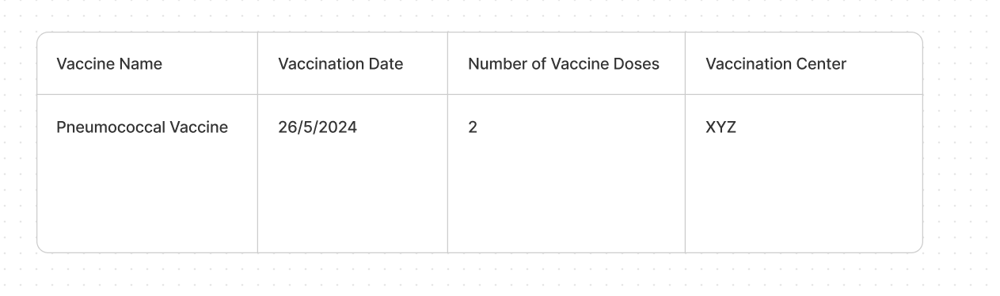

# New model migration for Patient Vaccination Details

## Requirements/Motive

Currently CARE only supports the storage of vaccination details related to COVID but as the COVID period is over, there arises a need to generalize the storage of vaccination details.

As the COVID specific Vaccination details is not relevant now, the existing fields related to it in the Patient Registration table must be removed.

## Implementation Approach

### Backend Changes

#### Extended ER diagram of Implementation

To start with the Backend Implementation a new model PatientVaccination must be introduced with fields such as:

- **patient** (ForeignKey to PatientRegistration)
- **vaccine_name** (choices from vaccineEnum)
- **date_of_vaccination** (DateField)
- **dose_number** (PositiveIntegerField, default 1)
- **vaccination_center** (CharField, max_length=255)
- **batch_number** (CharField, max_length=100)
- **created_by** (ForeignKey to User)
- **last_edited_by** (ForeignKey to User)

Serializers and Viewsets corresponding to the PatientVaccination model should be created and also the create() and update() methods of the existing PatientDetailSerializer should be modified to handle the storage of multiple vaccination details instances in the database.

After the inclusion of this new model all the existing fields in PatientRegistration model like vaccine_name, covin_id, last_vaccinated_date will be deprecated. So the Vaccination related fields in the PatientRegistration model will be migrated to a dedicated Table PatientVaccination as specified above. 

All the necessary validations should be added in the existing PatientDetailSerializer while creating or updating the vaccination details in the Patient Registration form.

### Mockups for Frontend Changes

#### Design Template for Vaccination Form

The form should be in the above format. Once the user enters "Yes" for the question "Is patient Vaccinated?" the above form should be visible. Vaccine Name field must be an Autocomplete form field, Date of Vaccination field should be a Date form field, Dose number field should be an Integer form field and Vaccination Center field should be a Text form field.

#### Design Template for displaying Vaccination Details in the Patient Dashboard

A table kind of layout should be creates instead of the existing display fields like vaccine name, last vaccinated on, number of doses. This would show all the vaccination details of the patient for multiple vaccines he/she has taken. This is different from the existing design layout which contains just one type of vaccine related to covid.

