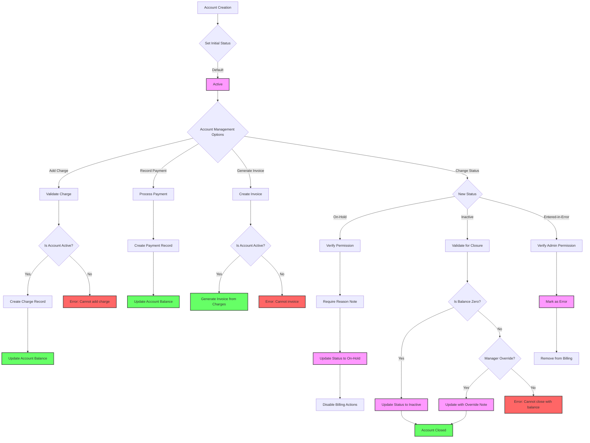

# Account

## Summary

The **Account** module manages financial accounts that accumulate charges and payments for a patient or specific purpose (e.g. an inpatient stay or service request cost). An Account serves as a “billing bucket” or ledger for tracking healthcare costs over time. Charges (for services or items) are applied to an Account, and payments or adjustments credit the Account. In essence, it is a central record against which charges, payments, and adjustments are recorded. This allows the system to keep a running total of what a patient (or their insurance) owes. Accounts contain information about who the account is for (the patient or entity) and who is responsible for paying the balance (such as insurance or a guarantor). _For example, when a patient is admitted, an Account is opened to track all charges during that hospitalization, and later, an invoice will be generated from this account._

:::info Note for Developers
The Account concept aligns with the FHIR **Account** resource, providing a tool to track values accrued for a particular purpose in healthcare billing. While an account will have a running balance conceptually, it typically does **not** store a live balance field. Instead, the current balance is computed from all associated charges and payments and cached. The system will provide a function to calculate the balance on demand by summing charges minus payments, you can use the `calculated_at` field to track when the balance was last computed and ensure data consistency.
:::

## Schema Definition

```json
{
  "id": "<str>", // Internal Identifier
  "status": "<string>", // active | inactive | entered-in-error | on-hold | unknown
  "billing_status": "<string>", // Bound to https://build.fhir.org/valueset-account-billing-status.html
  "name": "<string>", // Human-readable label
  "patient": "<id|fk>", // The entity that caused the expenses
  "facility": "<id|fk>", // Facility where this Account is created
  "service_period": "Period", // Transaction window
  "description": "<markdown>", // Explanation of purpose/use
  "balance": [
    {
      "aggregate": "<code>", // Patient or Insurer - Bound to https://build.fhir.org/valueset-account-aggregate.html
      "amount": {
        "value": "<decimel>", // Numerical value (with implicit precision)
        "currency": "<code>" // ISO 4217 Currency Code
      } // Calculated amount
    }
  ],
  "calculated_at": "<instant>" // Time the balance amount was calculated
}
```

## Core Data Structure

### Essential Fields

| Field              | Description                                                   | Technical Notes                                                       |
| ------------------ | ------------------------------------------------------------- | --------------------------------------------------------------------- |
| **id**             | Internal system identifier for the Account                    | Primary key, auto-generated                                           |
| **name**           | Human-readable label (e.g., "John Doe – 2025 Inpatient Stay") | Helpful for staff identification                                      |
| **patient**        | Foreign key reference to the patient                          | Only charges for this patient should be applied to this Account       |
| **facility**       | Reference to the healthcare facility                          | Used for organizational tracking and reporting                        |
| **status**         | Current lifecycle state of the Account                        | Controls available operations (see Status section)                    |
| **billing_status** | FHIR-compliant billing status code                            | Provides additional context beyond basic status                       |
| **service_period** | Date range covered by the Account                             | Typically maps to admission/discharge dates or specific billing cycle |
| **description**    | Markdown-formatted explanation of purpose                     | Provides additional context for staff                                 |
| **balance**        | Array of calculated balances by payer type                    | Segmented by responsible party (patient vs. insurer)                  |
| **calculated_at**  | Timestamp of last balance calculation                         | Ensures data freshness awareness                                      |

### Account Status Lifecycle

| Status Value         | Description                      | System Behavior                                      |
| -------------------- | -------------------------------- | ---------------------------------------------------- |
| **active**           | Account is open and operational  | Allows new charges, payments, and invoice generation |
| **on_hold**          | Account is temporarily suspended | Blocks new charges and invoices; requires resolution |
| **inactive**         | Account is permanently closed    | Prevents all new transactions; read-only mode        |
| **entered_in_error** | Account was created by mistake   | Excluded from billing processes and reporting        |

### Billing Status Values

| Billing Status             | Description                                         | Typical Usage                      |
| -------------------------- | --------------------------------------------------- | ---------------------------------- |
| **open**                   | Account is actively receiving charges               | Default for new accounts           |
| **carecomplete_notbilled** | Care is complete but billing process hasn't started | Transitional state after discharge |
| **billing**                | Invoicing and payment collection in progress        | Active billing cycle               |
| **closed_baddebt**         | Account closed due to uncollectible debt            | After collection attempts failed   |
| **closed_voided**          | Account canceled/voided                             | For erroneously created accounts   |
| **closed_completed**       | Account fully settled and closed                    | After full payment received        |
| **closed_combined**        | Account merged with another account                 | After account consolidation        |

### Balance Aggregate Types

| Aggregate Type | Description                                   | Purpose                                         |
| -------------- | --------------------------------------------- | ----------------------------------------------- |
| **patient**    | Portion of balance patient is responsible for | Track patient's direct financial responsibility |
| **insurance**  | Portion of balance expected from insurance    | Track expected insurance payments               |
| **total**      | Combined total balance                        | Overall account balance                         |

## Business Logic Highlights

- An account can accumulate many **Charge Items** (individual billed services) over time. Each Charge Item references the Account it belongs to. The Account itself does not list every charge internally; instead, charges “point” to the account. The system can retrieve all charges linked to a given account to compute the balance or prepare an invoice.
- **Adding Charges:** Only allowed on active accounts. If a user tries to add a charge to an inactive/on-hold account, the system should prevent it and alert the user.
- **Account Closure:** Typically done when the patient’s episode of care is complete and billing is finalized. The staff will mark the account as **inactive** (closed) after all invoices are issued and the balance is zero. The system might enforce that an account with outstanding balance cannot be closed. If closure is forced, it can only be done at managerial level. _(Developer note: implement a check that blocks closing an account if any unpaid invoices or unbilled charges exist.)_
- **On-hold Behavior:** Placing an account on hold might be used if, for example, insurance eligibility is in question or a billing dispute arises. In this state, new charges can be collected in the background but not officially billed until hold is released. The UI should visibly flag held accounts, and possibly require a note or reason for hold.



**Creating a New Account**

Accounts can be created in two ways:

1. Manual Creation from Patient Page
2. Automatic Creation on First Charge

In both cases, the account becomes immediately available for billing operations once created.

**Handling Account Holds:**

- If an account is on hold, the UI should prominently indicate this (e.g., a banner “On Hold”). While on hold, typical billing actions might be disabled or require override:
  - The “Add Charge” button might be hidden or greyed out with a tooltip “Account is on hold – cannot add charges.”
  - The “Generate Invoice” action might be disabled as well.
- To remove a hold, a staff user (often with appropriate permission) would edit the account and change status back to **active**. The system might log who removed the hold and when.

**Closing an Account (End of Cycle):**

- When all charges have been billed and paid, or the patient’s treatment cycle is over, the account should be closed. To do this, staff edits the account and sets **Status = Inactive**.
- The system will prompt “Are you sure you want to close this account? This action will mark the account as closed and no further charges can be added.” If confirmed, and validation passes (balance is zero, etc.), the status updates to inactive.
- Once inactive, the account is essentially archived for that episode. The UI might label it as **Closed**. Staff can still view details and history, but cannot add new entries. If somehow a late charge comes in after closure, typically a new account is needed.

**Account Balance Inquiry:**

- At any point, staff might need to inform a patient of their current balance. The account screen’s balance is calculated from charges and payments. If the patient or billing staff want a detailed statement, they can generate an **Account Statement** (which is essentially an on-demand invoice or report of all transactions). This is usually separate from the official Invoice process, but it gives a breakdown of charges, payments, and remaining due.

**Status Transitions:**

- Enforce rules when updating account status:
  - Only allow **inactive** if balance is 0 and no pending charges. If there is a balance, return a clear error to the UI.
  - Only allow **on-hold** or **active** transitions for appropriate user roles. Possibly log these changes for audit.
  - **entered-in-error** should only be used shortly after creation or if truly needed, and might require admin privileges, since it essentially invalidates the account.
