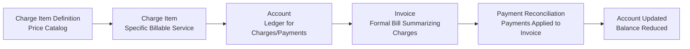

# Billing

This overview provides a **big-picture** look at how billing data and workflows are organized, from recording healthcare services to collecting payments. The subsequent pages detail each component and its usage.

## Key Billing Concepts

| **Concept**                | **Description**                                                                      |
| -------------------------- | ------------------------------------------------------------------------------------ |
| **Charge Item Definition** | Specifies billing rules and pricing for services or products.                        |
| **Charge Item**            | Represents a specific billable service or product provided to a patient.             |
| **Account**                | Aggregates all financial transactions for a patient, including charges and payments. |
| **Invoice**                | Formal document summarizing charges and payments, issued to request payment.         |
| **Payment Reconciliation** | Process of matching received payments with billed charges to ensure accuracy.        |

## High-Level Billing Flow

Below is a simplified look at how these pieces fit together:

1. **Charge Item Definition**: Administrators configure pricing rules and codes.
2. **Charge Item**: When a service is provided, a charge is created for the patient's **Account**, with cost details derived from the definition.
3. **Account**: Aggregates all patient charges and payments.
4. **Invoice**: Groups outstanding charges into a final bill. Once issued, the charges become billed.
5. **Payment Reconciliation**: Records any incoming payment, updating the invoice and account balances accordingly.

## Concept Diagram

