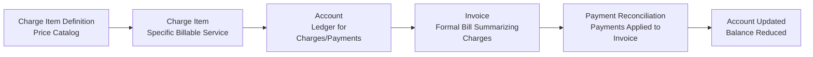

# Billing

This overview provides a **big-picture** look at how billing data and workflows are organized, from recording healthcare services to collecting payments. The subsequent pages detail each component and its usage.

## Key Billing Concepts

1. **Charge Item Definition**

   - **What it is:** The "catalog" or "tariff" of billable services and goods. Each definition includes a billing code, base price, optional surcharges/discounts/taxes, and applicability rules.
   - **Why it matters:** Ensures consistent and accurate pricing logic for all services.
   - **Where to learn more:** [Charge Item Definition Documentation](./ChargeItemDefinition)

2. **Charge Item**

   - **What it is:** A single, **actual** billable line for a specific service/product given to a patient (e.g., a lab test, medication, X-ray).
   - **Why it matters:** Records each instance of care or resource usage, along with quantity, date, and final cost.
   - **Where to learn more:** [Charge Item Documentation](./ChargeItem)

3. **Account**

   - **What it is:** A ledger or "billing bucket" that accumulates all charges and payments for a patient or purpose (e.g., an inpatient stay).
   - **Why it matters:** Centralizes the financial tracking, letting you see what the patient (or insurance) owes in total.
   - **Where to learn more:** [Account Documentation](./Account)

4. **Invoice**

   - **What it is:** A formal bill grouping multiple **Charge Items** from an **Account**. Once **issued**, the system expects payment against it.
   - **Why it matters:** Creates an official statement for patients or insurers, facilitating payment collection.
   - **Where to learn more:** [Invoice Documentation](./Invoice)

5. **Payment Reconciliation**
   - **What it is:** A record of payments received (and how they're allocated to invoices). Also handles reversals (e.g., bounced checks).
   - **Why it matters:** Keeps a detailed audit trail of all money flows, from partial payments to full settlements.
   - **Where to learn more:** [Payment Reconciliation Documentation](./PaymentReconciliation)

## High-Level Billing Flow

Below is a simplified look at how these pieces fit together:

1. **Charge Item Definition**: Administrators configure pricing rules and codes.
2. **Charge Item**: When a service is provided, a charge is created for the patient's **Account**, with cost details derived from the definition.
3. **Account**: Aggregates all patient charges and payments.
4. **Invoice**: Groups outstanding charges into a final bill. Once issued, the charges become billed.
5. **Payment Reconciliation**: Records any incoming payment, updating the invoice and account balances accordingly.

### Concept Diagram

