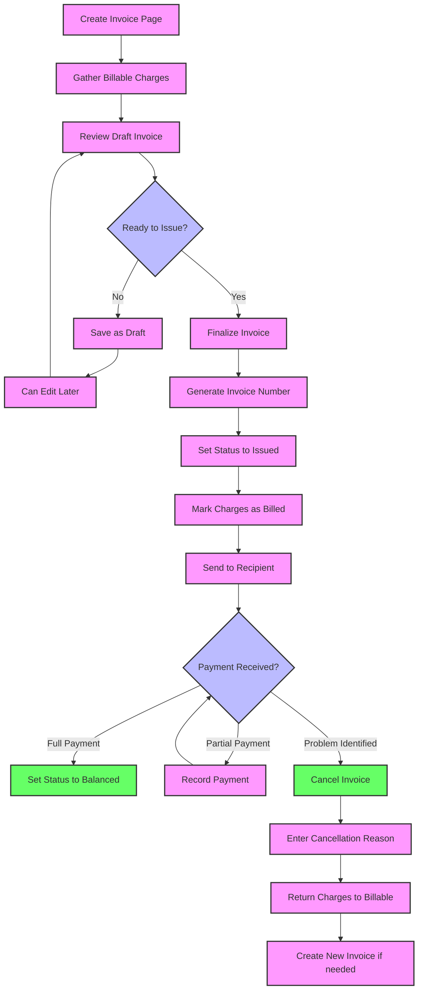

# Invoice

An **Invoice** groups multiple **Charge Items** into a formal bill for a patient or payer. Once an invoice is **issued**, those charges are considered billed. The invoice can then be sent to the patient or insurer for payment. The invoice includes line items referencing the original Charge Items, plus any summary of taxes or adjustments. Once fully paid, the invoice is marked **balanced**.

Key points about invoices:
- An invoice can be in different states (draft, issued, paid, etc.), reflecting its lifecycle.
- Invoices reference the account and the specific charge items included.
- Invoices typically have unique numbers for external reference, along with dates and payment terms.
- Once an invoice is issued (finalized), the charges on it are considered billed, and the invoice amount becomes a receivable for the hospital to collect from the payor.

## Schema Definition
```json
{
  "id": "<str>",                   // Internal Identifier
  "status": "<string>",            // draft | issued | balanced | cancelled | entered-in-error
  "cancelled_reason": "<string>",  // Reason if status=cancelled
  "type": "<string>",              // E.g., "professional", "pharmacy", etc.
  "patient": "<id|fk>",
  "facility": "<id|fk>",           // Facility issuing the invoice
  "account": "<id|fk>",            // The billing account associated
  
  "total_net": { "value": "<decimal>", "currency": "<string>" },
  "total_gross": { "value": "<decimal>", "currency": "<string>" },
  "payment_terms": "<markdown>",   // e.g. "Net 30 days"
  "note": "<markdown>"             // Extra comments about the invoice
}
```

## Core Data Structure

### Essential Fields

| Field | Description | Technical Notes |
|-------|-------------|----------------|
| **id** | Internal system identifier | Primary key, auto-generated |
| **status** | Current state in the billing lifecycle | Controls available actions and payment status |
| **cancelled_reason** | Explanation if invoice is cancelled | Required when status is "cancelled" |
| **type** | Classification of the invoice | Categorizes for reporting and workflow routing |
| **patient** | Reference to the patient | Person who received the services |
| **facility** | Reference to the healthcare facility | Location that issued the invoice |
| **account** | Reference to the billing account | Account containing the charges |
| **total_price_component** | Breakdown of invoice total | Includes subtotal, taxes, discounts, etc. |
| **total_net** | Net amount before adjustments | Sum of charge items before taxes/discounts |
| **total_gross** | Final billing amount | Final amount after all adjustments |
| **payment_terms** | Payment instructions | Due date, payment methods, etc. |

### Status Lifecycle

| Status Value | Description | System Behavior |
|--------------|-------------|----------------|
| **draft** | Invoice is in preparation | Can be edited; not yet sent to recipient |
| **issued** | Invoice is finalized and sent | Read-only; pending payment |
| **balanced** | Invoice is fully paid | Read-only; no balance due |
| **cancelled** | Invoice has been voided | Inactive; requires reason |
| **entered-in-error** | Invoice created by mistake | Excluded from all calculations |

## Business Logic Highlights

- **Draft Creation**: Invoices begin as drafts, allowing staff to review and adjust before finalization.

- **Charge Item Selection**: The system allows selecting which billable Charge Items to include on an invoice, typically gathering all unbilled charges from an account.

- **Finalization Process**: When an invoice is issued, all included Charge Items are marked as "billed" to prevent duplicate billing.

- **Payment Tracking**: The invoice status reflects payment completion, changing to "balanced" when fully paid.

- **Cancellation Handling**: If an invoice is cancelled, the system reverts its Charge Items to "billable" status so they can be included on a new invoice if needed.

- **Invoice Integrity**: Once issued, an invoice becomes read-only to maintain financial integrity. Changes require cancellation and reissuance.



**Creating an Invoice**:
1. Select the patient's account
2. The system gathers all billable (unbilled) Charge Items
3. Review the draft invoice and make any adjustments
4. When ready, finalize the invoice to generate an official invoice number
5. The system marks all included charges as "billed"
6. The invoice is now ready to be sent to the patient or insurer

**Payment Handling**:
1. When payments are received, they are recorded against the invoice
2. Partial payments keep the invoice in "issued" status
3. When the full amount is paid, the invoice status changes to "balanced"
4. The invoice remains as a permanent record of the billing transaction

**Cancellation Process**:
1. If an invoice needs to be cancelled, select "Cancel Invoice"
2. Enter a cancellation reason (required)
3. The system reverts all charges to "billable" status
4. If needed, create a new corrected invoice

**Multiple Invoice Scenarios**:
- Interim billing during long stays
- Separate invoices for different service types
- Insurance billing followed by patient responsibility billing
- Corrected invoices after error identification


## Key Fields and Lifecycle 
**Business Logic (Lifecycle & Rules):**
- **Drafting vs Finalizing:** Invoices can be prepared as draft, allowing staff to review and possibly get approval before issuing. While in draft, modifications are allowed:
  - Staff can add or remove line items (which corresponds to adding or removing Charge Items to the invoice). Usually, only charges that are in “billable” status and not yet invoiced can be added. 
  - They might adjust quantities or give discounts in this phase as well (for example, perhaps a manager can apply a manual discount line).
  - The invoice total is recalculated with each change.
- **Finalization (Issuing):** When staff are satisfied, they will finalize the invoice. At this point:
  - The invoice status changes to **issued**.
  - The system may assign the official invoice number (if it wasn’t assigned at creation).
  - The issue date is set (if not already).
  - All included Charge Items are marked as **billed** (their status updated, as discussed in Charge Item section).
  - The invoice becomes read-only for content; you generally shouldn’t edit line items after issuing (short of cancelling the invoice).
  - The invoice is now ready to be sent to the recipient (could be printed or electronically transmitted).
- **Posting/Printing:** Once issued, the invoice can be delivered. The system might have a function to print the invoice or to send it via email. The invoice document will list all charges and the total due.
- **Payments:** After issuance, the invoice sits in “issued” status until payment(s) are received:
  - If a payment comes in (via the Payment Reconciliation process), the invoice doesn’t immediately disappear; it just gains a record of payment. The invoice might show amount paid and remaining due.
  - When the total amount of the invoice has been paid, the system should mark the invoice as **balanced** automatically, indicating it’s fully settled. This could be done by the Payment Reconciliation logic (when it notices full payment).
  - Partial payments do not change the status (remain “issued”), but internal tracking of outstanding balance is updated.
- **Cancellation:** If an error is discovered on an issued invoice (e.g., a charge was wrong or the invoice was sent to the wrong payer), you may need to cancel it. Business rules:
  - Only allow cancellation if no (or minimal) payments have been applied. If payments exist, typically you can’t outright cancel; you might have to refund or reallocate payments first.
  - When cancelled, set status = cancelled, and record a cancellation reason. The system should also free up the underlying charge items to be billed on another invoice if appropriate. (i.e., change their status back to billable or even planned, depending on scenario).
  - Possibly generate a new invoice if needed (for correct charges). Or if the entire thing was wrong, just cancel and start over.
  - Cancelled invoices are kept for audit, but are not considered collectible.
- **Avoiding Duplicate Invoices:** The system should ensure the same charge isn’t invoiced twice. This is handled by charge status (once included on an issued invoice, a charge shouldn’t appear on another invoice). When creating an invoice, the selection of charges should exclude any that are already billed. If a user somehow attempts to include a charge that’s been billed, the system should flag it as not allowed.
- **Multiple Invoices per Account:** It’s possible to have multiple invoices for one account. For example, in a long hospital stay, they might generate interim invoices monthly, or one at discharge and then a supplementary one for late charges. The system should support picking which charges to include each time. Typically, an invoice might include all currently uninvoiced charges up to a cutoff date. If doing partial billing, the UI might allow selecting specific items or setting a date range.
- **Invoice for Insurance vs Patient:** If insurance is involved, an initial invoice might be created to send to the insurer (or an electronic claim, depending on integration). After insurer pays or responds, a secondary invoice (often called patient statement) might be created for the patient for any remaining amount. In our HMIS, the Invoice module could handle both by marking who it’s addressed to. For instance, invoice #100 to Insurance (for full charges) and after insurance adjustments, an invoice #101 to patient for copay/deductible. 
- **Invoice Adjustments/Credits:** If after issuing an invoice, one charge amount needs to be reduced (but not fully cancel the invoice), an approach is to add an adjustment line (negative line item) to the invoice.(How to do it?)
