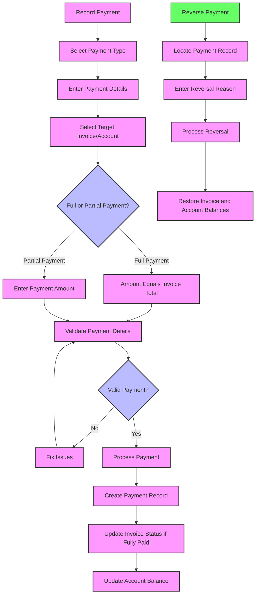

# Payment Reconciliation

**Payment Reconciliation** records **payments** (and possibly adjustments) made toward one or more invoices or accounts. It answers: *“Who paid, how much, and which invoice(s) or account(s) does this money apply to?”* By storing a Payment Reconciliation entry each time a patient or insurer submits payment, the system can track how the invoice balances shift from unpaid to partially paid to fully settled.

If a payment is reversed (e.g., check bounces), the Payment Reconciliation is canceled or marked in error, restoring the invoice’s outstanding amount. This ensures a complete audit trail of all financial transactions.


## Schema Definition
```json
{
  "id": "<str>",                 // Internal Identifier
  "type": "<string>",            // payment | adjustment | advance
  "status": "<string>",          // active | cancelled | draft | entered-in-error
  "kind": "<string>",            // e.g., "online", "online", "deposit"
  "issuerType": "<string>",      // "patient" or "insurer"
  "outcome": "<string>",         // queued | complete | error | partial
  "facility": "<id|fk>",
  "disposition": "<string>",     // Additional message or outcome detail
  "method": "<string>",          // Payment method (cash, check, credit, etc.)
  "datetime": "<datetime>",      // When payment was posted
  "referenceNumber": "<string>", // Check number or transaction reference
  "authorization": "<string>",   // Auth code if card-based
  "tenderedAmount": { "value": "<decimal>", "currency": "<string>" },
  "returnedAmount": { "value": "<decimal>", "currency": "<string>" },
  "amount": { "value": "<decimal>", "currency": "<string>" },  // Net amount posted
  "target_invoice": "<id|fk>",   // If a single-invoice payment
  "account": "<id|fk>",          // If no invoice, apply to Account
  "note": "<string>"
}
```

### Essential Fields

| Field | Description | Technical Notes |
|-------|-------------|----------------|
| **id** | Internal system identifier | Primary key, auto-generated |
| **type** | Category of payment transaction | Distinguishes between payments, adjustments, and advances |
| **status** | Current state of the payment record | Controls visibility and effect on balances |
| **kind** | Payment workflow classification | Tracks channel or method of payment receipt |
| **issuerType** | Source of the payment | Distinguishes between patient payments and insurance payments |
| **outcome** | Processing result of the payment | Tracks whether payment was fully processed |
| **facility** | Reference to the healthcare facility | Location where payment was recorded |
| **method** | Payment method used | Cash, check, credit card, bank transfer, etc. |
| **datetime** | Date and time of payment | When payment was received |
| **referenceNumber** | External transaction identifier | Check number, transaction ID, etc. |
| **amount** | Payment amount | The actual amount received |
| **target_invoice** | Reference to the invoice | Invoice being paid (if applicable) |
| **account** | Reference to the billing account | Used when payment applies to account rather than specific invoice |

### Status Values

| Status Value | Description | System Behavior |
|--------------|-------------|----------------|
| **active** | Payment is complete and valid | Included in financial calculations |
| **cancelled** | Payment has been reversed | Excluded from balances; requires reversal processing |
| **draft** | Payment is being processed | Not yet included in financial calculations |
| **entered-in-error** | Payment recorded incorrectly | Excluded from all calculations |

### Payment Types

| Type | Description | Usage |
|------|-------------|-------|
| **payment** | Standard monetary transaction | Normal payments from patients or insurance |
| **adjustment** | Non-monetary balance change | Contractual adjustments, write-offs, etc. |
| **advance** | Payment before services | Pre-payments or deposits |

### Payment Outcomes

| Outcome | Description | Next Steps |
|---------|-------------|-----------|
| **queued** | Payment is pending processing | Requires follow-up to complete |
| **complete** | Payment fully processed | No additional action needed |
| **error** | Payment processing failed | Requires investigation and correction |
| **partial** | Payment partially processed | Remaining processing needed |


### Payment Kinds

| Kind Value | Description | Usage |
|------------|-------------|--------|
| **deposit** | One-time payment deposit | Used for upfront payments or security deposits |
| **preriodic_payment** | Recurring scheduled payment | For payment plans or installments |
| **online** | Payment made through web portal | Self-service online payments |
| **kiosk** | Payment made at payment kiosk | Self-service kiosk payments |


### Payment Issuer Types

| Issuer Type | Description | Usage |
|-------------|-------------|--------|
| **patient** | Payment from patient | Direct payments from patients or their representatives |
| **insurance** | Payment from insurance | Payments from insurance companies or third-party payers |

### Payment Methods

| Method Code | Description | Usage |
|------------|-------------|--------|
| **cash** | Cash payment | Physical currency payments |
| **ccca** | Credit card payment | Payment via credit card |
| **cchk** | Credit check | Payment via credit check |
| **cdac** | Credit/debit account | Payment via linked bank account |
| **chck** | Check payment | Payment via paper check |
| **ddpo** | Direct deposit | Payment via bank deposit |
| **debc** | Debit card | Payment via debit card |


## Flow



## Business Logic

- When a payment is recorded, the amount gets distributed to invoices:
  - If the user is recording a payment for a single invoice (like patient pays their bill), the system will auto-allocate full amount to that invoice (and check if it matches the invoice amount, if not, treat as partial payment).
  - If the payment is meant for multiple invoices (like an insurance bulk payment or patient paying multiple bills at once), the UI should allow selecting multiple target invoices and specifying amounts for each. The sum of allocations should equal the payment.
  - The account’s balance and each invoice’s balance need to update accordingly: subtract the paid amounts.
- If a payment fully covers an invoice, mark the invoice **balanced** (paid in full). If partially, invoice remains **issued** with remaining balance.
- If a payment exceeds what was due (overpayment), the system might either hold the extra as a credit on the account (unallocated) or ask the user to adjust the allocation (maybe the patient intended to pay only what was due).
- Payment records can also represent **refunds or chargebacks** if negative amounts are allowed or by using cancellation:
  - We'll keep it simpler by saying to cancel or reverse the payment rather than negative entries.
- The Payment Reconciliation acts as a receipt internally. 
- The module also handles **adjustments** from insurance. These might be recorded as a special kind of allocation (with no actual payment but reduces invoice balance). 
- Ensuring that after posting all payments, any remaining balance on an invoice is correctly represented.
- Payments should update the **Account** as well: since account balance is charges minus payments, adding a payment will reduce the account’s balance.
- If a Payment Reconciliation is cancelled (like a bounced check), the system should re-open those invoice balances:
  - The invoice status goes back from balanced to issued if it was fully paid by that payment.
  - If partial, increase the outstanding amount accordingly.
  - Possibly log the reason (bounced check fee maybe separate).
- There should be integrity: you shouldn’t be able to apply more money to an invoice than its amount (except if intentionally overpay, which then needs handling like credit).
- Payment Reconciliation records also help in reconciling with bank deposits (each day’s cash, check, credit totals). So you might have reports grouping payments by date/method for bank reconciliation.

## Payment Posting

**Handling a Payment Reversal (Bounced check or error):**
1. Locate the Payment record (e.g., search by check number or patient).
2. Use a **“Cancel Payment”** or **“Reverse Payment”** action. The system might ask for a reason (“Check bounced due to insufficient funds”).
3. On confirmation, the Payment Reconciliation status changes to **Cancelled** (or enters an error state). The system effectively **negates the effects** of that payment:
   - The associated invoices’ balances are increased back by the amounts that this payment had covered.
   - If those invoices were marked paid, they revert to issued (not paid). If partially paid, their outstanding increases.
   - The account balance goes up accordingly.
   - Optionally log an internal note on the invoice or account about this reversal.
4. The cancelled payment record remains for audit, perhaps with a note, but is not counted in totals.

**Viewing Payment History:**
- On a patient account or invoice screen, staff can see a list of payments applied. For each payment: date, amount, method, reference. If one payment covered multiple invoices, that payment might show up in each relevant account’s history (with the portion that applied).
- There may also be a standalone Payment Reconciliation list (for all payments) where staff (like finance) can search by date range, method, etc., to do end-of-day reconciliation (e.g., total cash collected today).
- Reports can be generated, like “Daily Cash Collection Report” summing all payments by type, which should match actual cash in hand or bank deposits.