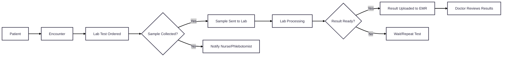

# Labs & Diagnostics Module

This overview provides a high-level understanding of how diagnostic workflows are structured in CARE — from test orders to sample collection, report generation and recording observations. The subsequent pages detail each resource and its role in the system.

## Key Concepts

| Resource              | Description                                                                                                                   |
| --------------------- | ----------------------------------------------------------------------------------------------------------------------------- |
| ServiceRequest        | A record of a request for service such as diagnostic investigations, treatments, or operations to be performed.               |
| ActivityDefinition    | A template that defines a standard lab or imaging procedure                                                                   |
| SpecimenDefinition    | A record of a sample to be used for analysis.                                                                                 |
| ObservationDefinition | A template that defines lab test results or imaging findings — defining expected units, value types, and coded terminologies. |
| ChargeItemDefinition  | A template that provides the properties that apply to the (billing) codes necessary to calculate costs and prices.            |
| DiagnosticReport      | The findings and interpretations of diagnostic tests performed on a patient.                                                  |

## High-Level Labs Flow

Below is a simplified look at how these pieces fit together:

### Concept Diagram

