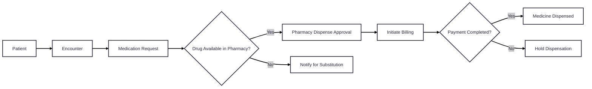

# Pharmacy

## Key Pharmacy Concepts

This table outlines the primary components of the CARE Pharmacy Module, detailing their roles and associated FHIR resources.
| **Concept** | **FHIR Resource** | **Description** |
| --- | --- | --- |
| **Patient** | `Patient` | Represents an individual receiving healthcare services. |
| **Encounter** | `Encounter` | An interaction between a patient and healthcare provider(s) for the purpose of providing healthcare service(s). |
| **Medication Request** | `MedicationRequest` | An order or request for both the supply of the medication and the instructions for administration. |
| **Medication Dispense** | `MedicationDispense` | Indicates that a medication product is to be or has been dispensed for a named person/patient. |
| **Inventory Item** | `InventoryItem` | Represents a product in the inventory, including details like quantity, location, and status. |
| **Product** | `Medication` | The specific medication product, including its identification and definition. |
| **Product Knowledge** | `MedicationKnowledge` | Provides detailed information about a medication, including its composition, indications, and contraindications. |
| **Charge Item Definition** | `ChargeItemDefinition` | Defines the prices, factors, and conditions that apply to a billing code. |
| **Charge Item** | `ChargeItem` | Represents the provision of healthcare provider products for a patient, including billing details. |
| **Supply Request** | `SupplyRequest` | A record of a request to deliver a medication, substance, or device used in the healthcare setting. |
| **Supply Delivery** | `SupplyDelivery` | Records the delivery of a supply item. |
| **Location** | `Location` | Details and position information for a physical place where services are provided and resources are stored. |

## High-Level Pharmacy Flow

Below is a simplified look at how these pieces fit together:

## Concept Diagram

