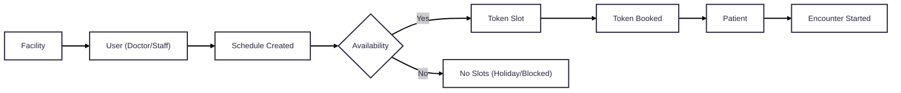

# Scheduling

## Key Scheduling Concepts

| **Concept**                 | **Description**                                                                            |
| --------------------------- | ------------------------------------------------------------------------------------------ |
| **SchedulableUserResource** | A healthcare provider (e.g., doctor, nurse) whose time can be scheduled within a facility. |
| **AvailabilityException**   | Specific time periods when a provider is unavailable (e.g., leave, holidays).              |
| **Schedule**                | Defines recurring availability patterns (e.g., daily 9 AM – 5 PM) for a provider.          |
| **Availability**            | Specific dates/times within a schedule when appointments can be booked.                    |
| **TokenSlot**               | A concrete, bookable time unit available for patient appointments.                         |
| **TokenBooking**            | Represents a confirmed appointment, linking a patient to a specific time slot.             |

## High-Level Scheduling Flow

Below is a simplified look at how these pieces fit together:

## Concept Diagram

    
