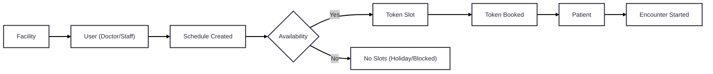

# Scheduling

## Key Concepts

1.  **Schedulable User Resource**

    – A healthcare worker (e.g., doctor, nurse) whose time can be scheduled on a facility.

2.  **Availability Exception**

    – Custom constraints or blocks (e.g., leave, holidays) applied to a Schedulable User.

3.  **Schedule**

    – Represents recurring availability patterns (e.g., daily 9 AM – 5 PM) of a Schedulable User.

4.  **Availability**

    – Specific dates/times (within a schedule) where bookings can be made. Links to **Slots**.

5.  **Token Slot**

    – A concrete, bookable time unit that can be reserved by a patient (analogous to `Slot` in FHIR).

6.  **Token Booking**

        – Represents an appointment, tied to a `Patient` and results in an `Encounter`.

## High-Level Scheduling Flow

Below is a simplified look at how these pieces fit together:

### Concept Diagram

    
