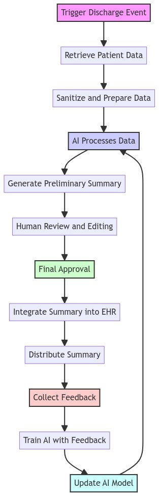
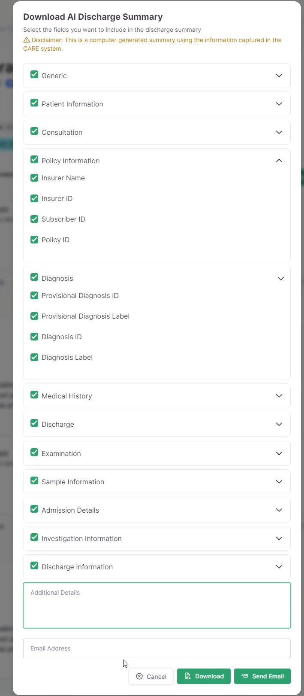

# Discharge Summary Documentation

| Document        | Discharge Summary Feature Documentation (`discharge_summary`)             |
|-----------------|-------------------------------------------------------------------|
| **Title**       | AI-Powered Patient Discharge Summary Generation and Integration        |
| **Last-Modified** | 2024-05-06                                                         |
| **Type**        | Technical Documentation                                              |
| **Created**     | 2024-05-06                                                      |
| **Review Period** | * 2024-05-06 - 2024-05-13                                            |
| **References**  | - Based on the community's best practices for technical documentation |

# Table of Contents

 0. [Overview](#overview)
    1. [Implementation](#implementation)
        1. [Step 1: Breaking Down the Data](#step-1-breaking-down-the-data)
        2. [Step 2: Anonymizing Patient Information](#step-2-anonymizing-patient-information)
        3. [Step 3: Sending JSON to AI Model](#step-3-sending-json-to-ai-model)
        4. [Step 4: AI Model Processing](#step-4-ai-model-processing)
        5. [Step 5: Consolidation of Summaries](#step-5-consolidation-of-summaries)
        6. [Step 6: Presentation of Final Summary](#step-6-presentation-of-final-summary)
1.  [Introduction](#introduction)
    1.  [Overview of AI-Powered Discharge Summaries](#overview-of-ai-powered-discharge-summaries)
    2.  [Purpose and Benefits](#purpose-and-benefits)
    3.  [Scope of Documentation](#scope-of-documentation)
2.  [Getting Started](#getting-started)
    1.  [System Requirements](#system-requirements)
    2.  [Installation Guide](#installation-guide)
    3.  [Initial Setup](#initial-setup)
3.  [Feature Flow](#feature-flow)
    1.  [High-Level Feature Operation](#high-level-feature-operation)
    2.  [Detailed Flowchart Explanation](#detailed-flowchart-explanation)
4.  [Technical Deep Dive](#technical-deep-dive)
    1.  [Data Extraction and Anonymization](#data-extraction-and-anonymization)
    2.  [AI Model Selection and Training](#ai-model-selection-and-training)
    3.  [Summary Generation and Consolidation](#summary-generation-and-consolidation)
    4.  [PDF Report Generation (Optional)](#pdf-report-generation-optional)
5.  [Integration with Healthcare Management Application](#integration-with-healthcare-management-application)
6.  [User Interface and Interaction](#user-interface-and-interaction) 
7.  [Evaluation and Performance Metrics](#evaluation-and-performance-metrics)
8.  [Appendix](#appendix)
    1.  [Code Snippets](#code-snippets) 
    2.  [References](#references)
    3.  [Acknowledgements](#acknowledgements)
9.  [Changelog](#changelog)
10. [Contact and Support](#contact-and-support) 
  


## Overview

The length and complexity of patient discharge summaries can sometimes pose a challenge for healthcare professionals who need to quickly understand a patient's medical history. To address this, we have developed a unique feature in our healthcare management application that uses Artificial Intelligence (AI) to summarize these discharge summaries. This write-up provides a step-by-step overview of how this feature works, from the initial parsing of the discharge summary to the final presentation of the summarized data. 

### Implementation

#### Step 1: Breaking Down the Data 

Parsing the Discharge Summary The first step involves parsing the discharge summary into separate sections.

These sections include:

-   Admission Details
-   Symptoms at Admission
-   Diagnosis
-   Medication History
-   Treatment Summary
-   General Instructions
-   Special Instructions

#### Step 2: Anonymizing Patient Information 

Before any data is sent to the AI model, we ensure to anonymize any Personally Identifiable Information (PII) of the patient. This is done by identifying and replacing any direct matches of the patient's name with a generic placeholder. This step is crucial for maintaining patient privacy and adhering to data protection regulations. It ensures that the AI model does not process any sensitive information that could potentially identify the patient. 

Currently, the following properties are redacted from all the places before being sent:

-   Full name
-   Address
-   Phone number
    

#### Step 3: Sending JSON to AI Model 

Each JSON object is then sent one by one to the AI model, which is powered by OpenAI's GPT-4. This model has been trained on a diverse range of internet text, which enables it to generate a summarized version of the data contained within each JSON object. 

Prompt Structure:
```
SYSTEM: You are a healthcare AI tasked with generating a discharge summary for a patient. Given the patient details provided in the JSON format below, generate a summary of the data. SECTION TITLE  JSON OBJECT
```
The following fields are recorded and sent in the JSON:

Category |	Label	| Value
------- | -------- | --------
Generic	| Facility Name |	patient.facility.name
Generic	| Date	| date
Patient Information	| Patient Name	| patient.name
Patient Information	| Patient Gender	| patient.get_gender_display 
Patient Information	| Patient Age |	patient.age
Patient Information	| Patient Date of Birth |	patient.date_of_birth
Patient Information |	Patient Blood Group |	patient.blood_group
Patient Information |	Patient Phone Number |	patient.phone_number 
Patient Information	| Patient Address	| patient.address
Patient Information	| Patient Summary |	summary.patient_summary
Consultation	| Consultation Status	| consultation.get_consultation_status_display
Consultation	| Consultation Suggestion	| consultation.get_suggestion_display
Consultation |	Admission Date	| consultation.admission_date.date
Consultation	| Consultation Notes	| consultation.consultation_notes
Consultation	| Special Instruction	| consultation.special_instruction
Consultation	| Prescribed Medication	| consultation.prescribed_medication
Consultation	| Procedure	| procedure.procedure
Consultation	| Procedure Frequency	| procedure.frequency
Consultation |	Procedure Time	| procedure.time
Consultation |	Procedure Notes	| procedure.notes
Consultation |	Investigation Type	| investigation.type
Consultation |	Investigation Frequency	| investigation.frequency
Consultation	| Investigation Time	| investigation.time
Consultation |	Investigation Notes	| investigation.notes
Patient Information |	Present Health	| patient.present_health
Patient Information |	Ongoing Medication |	patient.ongoing_medication
Patient Information	| Allergies	| patient.allergies
Patient Information |	IP No	| consultation.ip_no
Patient Information |	Weight	| consultation.weight
Patient Information |	Height	| consultation.height
Patient Information |	Symptoms	| consultation.get_symptoms_display|title
Patient Information	| Symptoms Onset Date	| consultation.symptoms_onset_date.date
Patient Information	| Admission Summary	| summary.admission_summary
Patient Information |	Date of Result	| patient.date_of_result.date
Patient Information	| Is Vaccinated |	
Policy Information	| Insurer Name |	policy.insurer_name
Policy Information |	Insurer ID	| policy.insurer_id
Policy Information |	Subscriber ID |	policy.subscriber_id 
Policy Information	| Policy ID	| policy.policy_id 
Diagnosis	| Provisional Diagnosis ID	| disease.id
Diagnosis	| Provisional Diagnosis Label	| disease.label
Diagnosis	| Diagnosis ID |	disease.id
Diagnosis |	Diagnosis Label	| disease.label
Medical History |	Medical History Disease |	disease.get_disease_display
Medical History	| Medical History Details	| disease.details
Discharge	| Discharge Notes	| consultation.discharge_notes
Discharge	| Death Date Time	| consultation.death_datetime
Discharge |	Death Confirmed By	| consultation.death_confirmed_by
Discharge	| Discharge Summary	| consultation.suggestion === 'R'
Prescription |	Prescription Medicine Name	| prescription.medicine_name
Prescription |	Prescription Dosage	| prescription.dosage
Prescription |	Prescription Route	| prescription.route
Prescription |	Prescription Frequency	| prescription.frequency
Prescription	| Prescription Days	| prescription.days
Prescription	| Prescription Notes	| prescription.notes
PRN Prescription	| PRN Prescription Medicine Name	| prescription.medicine_name
PRN Prescription	| PRN Prescription Dosage	| prescription.dosage
PRN Prescription |	PRN Prescription Max Dosage |	prescription.max_dosage
PRN Prescription	| PRN Prescription Min Hours Between Doses |	prescription.min_hours_between_doses
PRN Prescription	| PRN Prescription Route	| prescription.route
PRN Prescription |	PRN Prescription Indicator	| prescription.indicator
Examination	| Examination Details	| consultation.examination_details
Sample Information |	Sample Created Date	| sample.created_date
Sample Information	| Sample Type	| sample.get_sample_type_display
Sample Information	| ICMR Label	| sample.icmr_label
Sample Information |	Sample Result	| sample.get_result_display 
Patient Information	| Treatment Summary |	summary.treatment_summary
Admission Details |	Daily Round Created Date	| daily_round.created_date
Admission Details |	Patient Category	| daily_round.get_patient_category_display 
Admission Details |	Physical Examination Info	| daily_round.physical_examination_info
Admission Details	| Other Details	| daily_round.other_details
Admission Details	| Additional Symptoms	| daily_round.additional_symptoms
Admission Details |	Daily Rounds Summary |	summary.dailyrounds_summary
Investigation Information	| Investigation Group	| investigation.investigation.groups.first
Investigation Information	| Investigation Name	| investigation.investigation.name
Investigation Information	| Investigation Value	| investigation.value
Investigation Information |	Investigation Notes	| investigation.notes
Investigation Information	| Investigation Min Value |	investigation.investigation.min_value
Investigation Information	| Investigation Max Value	| investigation.investigation.max_value
Investigation Information |	Investigation Unit	| investigation.investigation.unit
Investigation Information	| Investigation Created Date	| investigation.created_date 
Investigation Information	| Investigation Summary	| summary.investigation_summary
Discharge Information |	Discharge Date	| consultation.discharge_date
Discharge Information	| Discharge Reason	| consultation.get_discharge_reason_display
Discharge Information	| Discharge Prescription Medicine Name	| prescription.medicine_name
Discharge Information |	Discharge Prescription Dosage |	prescription.dosage 
Discharge Information	| Discharge Prescription Route	| prescription.route 
Discharge Information	| Discharge Prescription Frequency	| prescription.frequency
Discharge Information	| Discharge Prescription Days |	prescription.days
Discharge Information	| Discharge Prescription Notes |	prescription.notes 
Discharge Information	| Discharge PRN Prescription Medicine Name	| prescription.medicine_name
Discharge Information	| Discharge PRN Prescription Dosage |	prescription.dosage
Discharge Information |	Discharge PRN Prescription Max Dosage	| prescription.max_dosage
Discharge Information	| Discharge PRN Prescription Min Hours Between Doses |	prescription.min_hours_between_doses
Discharge Information	| Discharge PRN Prescription Route	| prescription.route
Discharge Information	| Discharge PRN Prescription Indicator	| prescription.indicator
Discharge Information |	Discharge Notes	| consultation.discharge_notes
Discharge Information |	Verified By	| consultation.verified_by|linebreaks
Discharge Information |	Discharge Summary	| summary.discharge_summary


#### Step 4: AI Model Processing

The AI model processes each JSON object independently and generates a summary for each section. This process is performed iteratively, starting from the 'Introduction' section and ending with the 'Special Instructions' section. 

Prompt Structure for subsequent iterations.

```
SYSTEM: You are a healthcare AI tasked with generating a discharge summary for a patient. Given the patient details provided in the JSON format below, generate a summary of the data. The following is a summary of the patient so far: SUMMARY of N-1 ITERATION With the above context, include the following information to the provided summary. SECTION TITLE  JSON_OBJECT
```

#### Step 5: Consolidation of Summaries 

After all the sections have been processed by the AI model, the individual summaries are consolidated into a single, comprehensive summary. Importantly, while generating the summary of each subsequent section, a summary of the previous sections is passed along in the prompt to the AI. This provides essential context, enabling the AI to maintain continuity and coherence in the overall narrative. The final summary, therefore, provides a succinct and contextually aware overview of the patient's hospital journey. 

A sample of summaries generated for each section:

- Patient Details: 

> The patient, a 23-year-old male with blood group B+, was discharged on
> August 13, 2023.

- Admission Summary:

> The patient, an outpatient, was admitted on January 4, 2023, with
> symptoms of fever and cough…

- Treatment Summary:

> The patient has been prescribed Amlodipine and Paracetamol Pediatric
> Syrup/Suspension IP for treatment. The Paracetamol is to be
> administered due to a headache. The patient is also advised to use a
> non-woven adhesive tape…

- Discharge Summary:

> The patient was discharged on August 13, 2023, at 8:58 p.m. after
> recovery. The patient is advised to continue taking any prescribed
> medications as per the instructions of the healthcare provider …… This
> discharge summary has been verified by Dr. Anuj Sharma.


#### Step 6: Presentation of Final Summary 

The final summary is then presented to the user, allowing healthcare professionals to quickly understand a patient's medical history and make informed decisions. 

A sample of the final summary after consolidating all the above summaries:

> The patient, a 23-year-old male with a blood group of B+, was
> initially admitted as an outpatient on January 4, 2023, under the IP
> No. 15484518. He presented with symptoms of fever and a persistent
> cough, which led to a diagnosis of acquired iron deficiency anaemia
> due to blood loss (ID 942744561). His medical history revealed no
> co-morbidities, and he reported no allergies. His ongoing medication
> included Acetaminophen 500mg for fever, cough syrup, antibiotics, and
> iron supplements 
> 
> The treatment plan was updated to include Amlodipine Tab IP (Film
> Coated), 5 mg IV OD, and Paracetamol Paediatric Syrup/Suspension IP,
> 125mg/5ml 12 mg IV HS for 12 days due to a headache. Non-Woven
> Adhesive Tape, 2.5cm X 9.1 mtr, 6 mg was also prescribed. Nutritional
> support was provided to manage the iron deficiency anemia, and steam
> inhalation was recommended for symptomatic relief. Comfort care
> included ice pack application on the head every 6 hours. 
> 
> Investigations included a Urine Test (GROUP) every 6 hours to identify
> any underlying causes. Special instructions included administering an
> ice pack on the patient's head every 6 hours to manage the elevated
> body temperature. The patient was admitted for further observation and
> treatment, and comfort care was provided during the hospital stay. 
> 
> On January 15, 2023, the patient's condition was noted as critical,
> with symptoms of fever, cough, and breathlessness. On August 13, 2023,
> a series of urine tests were conducted, the results of which were
> integrated into the patient's medical history. The patient's condition
> was regularly monitored through vitals, blood tests for anemia, and
> specialist consultations. 
> 
> The decision to discharge the patient was made on August 13, 2023, at
> 858 p.m., after careful evaluation of his condition and progress. The
> reason for discharge was recovery. The patient was informed about the
> discharge and provided with relevant post-discharge care and
> medication instructions. The patient was advised to continue taking
> any prescribed medications as instructed by the healthcare provider
> and to follow the recommended dosage and schedule. While the patient
> has made good progress, he was advised to continue resting and avoid
> strenuous activities for the next few days. This discharge was
> verified by Dr. Anuj Sharma. 
> 
> The patient's health status will continue to be monitored through
> follow-up appointments. The patient was advised to keep in touch with
> the healthcare team for any queries or health concerns post-discharge.
> Any necessary adjustments to the treatment plan will be made based on
> the results of ongoing monitoring.

## Introduction

Patient discharge summaries are crucial documents that encapsulate a patient's hospital stay, including their medical history, diagnosis, treatment, and post-discharge care instructions. However, these summaries can often be lengthy and complex, making it difficult for healthcare professionals to quickly grasp the essential information.

### Overview of AI-Powered Discharge Summaries

To address this challenge, we have implemented a feature that leverages Artificial Intelligence (AI) to automatically generate concise and informative summaries of patient discharge summaries. This feature utilizes advanced natural language processing techniques to extract key information from the original document and present it in a clear and structured format. 

### Purpose and Benefits

The primary goal of this feature is to improve the efficiency and effectiveness of healthcare delivery by:

* **Saving Time:**  Healthcare professionals can quickly review the summarized information without needing to read through the entire discharge summary.
* **Enhancing Comprehension:** The AI-generated summaries present the key points in a clear and concise manner, making it easier to understand the patient's medical journey.
* **Improving Communication:** The summaries can be easily shared with other healthcare providers, ensuring everyone involved in the patient's care has access to the essential information.
* **Reducing Errors:** By providing a clear overview of the patient's condition and treatment, the summaries can help prevent misinterpretations and potential errors in post-discharge care.

### Scope of Documentation 

This documentation will delve into the technical details of the AI-powered discharge summary feature, covering aspects such as:

* Data extraction and anonymization processes
* AI model selection and training
* Summary generation and consolidation techniques
* Integration with the healthcare management application
* User interface and interaction 
* Evaluation and performance metrics

This document is intended for developers, data scientists, and healthcare professionals interested in understanding the inner workings of this feature and its potential impact on healthcare delivery. 


## Getting Started

### System Requirements

Before installing the Discharge Summary plugin, ensure that your system meets the following requirements:

- **Operating System**: Windows 10 or later, MacOS 10.14 Mojave or later, or a compatible Linux distribution (e.g., Ubuntu 20.04 or later).
- **Python Version**: Python 3.6 or higher. This is necessary for running the backend components of the Discharge Summary plugin.
- **Web Server**: Apache or Nginx. These servers are recommended for hosting the application but are not strictly required if running in a development environment.
- **Database**: PostgreSQL 9.6 or higher. This database system is preferred due to its robustness and compatibility with Django applications.
- **Memory and Processor**: Minimum of 4 GB RAM and a dual-core processor, although more may be required depending on the number of concurrent users and the data volume.
- **Additional Software**: Django 3.1 or higher, Django REST Framework for APIs, and other Python libraries as specified in the plugin’s requirements file.

### Installation Guide

To install the Discharge Summary plugin, follow these steps:

1. **Environment Setup**:
   - Ensure Python and pip (Python package manager) are installed on your system.
   - It's recommended to use a virtual environment to avoid conflicts with other Python packages. You can create a virtual environment using:
     ```
     python -m venv env
     source env/bin/activate  # On Windows use `env\Scripts\activate`
     ```

2. **Clone the Plugin Repository**:
   - Obtain the latest version of the Discharge Summary plugin from the official GitHub repository:
     ```
     git clone https://github.com/coronasafe/discharge_summary.git
     cd discharge_summary
     ```

3. **Install Dependencies**:
   - Install the required Python packages using pip:
     ```
     pip install -r requirements.txt
     ```

4. **Database Setup**:
   - Configure your database settings in Django’s settings file (usually `settings.py`).

5. **Run Migrations**:
   - Apply the database migrations to set up the necessary database schema:
     ```
     python manage.py migrate
     ```

6. **Collect Static Files** (if deploying in a production environment):
   - Collect all static files into the designated folder:
     ```
     python manage.py collectstatic
     ```

### Initial Setup

After installing the Discharge Summary plugin, perform the following initial setup tasks:

1. **Configure Plugin Settings**:
   - Open the Django settings file and add the Discharge Summary plugin to your installed apps:
     ```python
     INSTALLED_APPS += ['discharge_summary']
     ```
   - Configure additional plugin settings such as the API key for external services:
     ```python
     SERVICE_PROVIDER_API_KEY = 'your_api_key_here'
     ```

2. **Start the Development Server**:
   - To test the installation, start the Django development server:
     ```
     python manage.py runserver
     ```
   - Visit `http://127.0.0.1:8000/` in your web browser to see if the application is running correctly.

3. **Verify System Integration**:
   - Ensure that the Discharge Summary plugin is correctly integrated with the CARE system by generating a test discharge summary from the administrative interface.

4. **User Access Management**:
   - Set up user roles and permissions to control access to the Discharge Summary functionalities, ensuring that only authorized personnel can generate and view discharge summaries.

By following these steps, your system should be fully prepared to use the Discharge Summary plugin effectively within the CARE platform.

## Feature Flow

### High-Level Feature Operation

The Discharge Summary plugin operates through a series of steps that integrate closely with the CARE platform, utilizing AI technology to automate the generation of patient discharge summaries. Here’s an outline of the high-level operation:

1. **Data Collection**:
   - When a patient is ready for discharge, the plugin collects all necessary patient data from the hospital management system, including medical history, treatment details, and doctor’s notes.

2. **Data Processing**:
   - The collected data is then processed and formatted appropriately to ensure compatibility with the AI model. This step may include anonymizing patient data to protect privacy.

3. **AI Summary Generation**:
   - The processed data is fed into the AI model. The AI uses GPT (Generative Pretrained Transformer) models to generate a structured and concise discharge summary.

4. **Review and Edit**:
   - Once the AI generates the initial summary, it can be reviewed and edited by medical staff to ensure accuracy and completeness.

5. **Final Approval and Dissemination**:
   - After final approval, the discharge summary is automatically entered into the discharge record and can be printed or electronically sent to the patient and relevant healthcare providers.

6. **Feedback Loop**:
   - Medical staff provide valuable feedback on the AI-generated summaries. This feedback, currently shared with us manually, is instrumental in continuously refining and improving the accuracy of our AI model for future summaries.

### Detailed Flowchart Explanation 



1. **Trigger Discharge Summary Generation:** The process is initiated when a healthcare professional triggers the generation of an AI-powered discharge summary for a specific patient.
2. **Fetch Patient Data:** The application retrieves the necessary patient data, including the discharge summary, demographics, medical history, diagnosis, treatment details, and any relevant notes or instructions.
3. **Anonymize Patient Information:**  Before any data is sent to the AI model, sensitive information like the patient's name, address, and phone number is anonymized using placeholder values. 
4. **Structure Data:** The anonymized data is structured into a JSON format, organizing it into sections corresponding to different aspects of the discharge summary (e.g., "Admission Details," "Treatment Summary," "Discharge Instructions").
5. **Iterative Summary Generation:** 
    * **Section Processing:** Each section of the structured data is sent individually to the AI model along with a prompt that includes the summary of the previous sections to maintain context and coherence. 
    * **AI Model Inference:** The AI model processes the data and prompt for each section and generates a concise summary of the key information. 
    * **Summary Storage:** The generated summary for each section is stored temporarily.
6. **Consolidate Summaries:** The individual section summaries are combined into a single comprehensive discharge summary, ensuring a smooth flow and logical structure.
7. **Generate PDF Report (Optional):** The final summary can be optionally converted into a PDF report for easy sharing and printing.
8. **Present Summary:** The AI-generated summary, either as text or a PDF report, is presented within the healthcare management application, allowing healthcare professionals to quickly review the patient's case.

## Technical Deep Dive

### Data Extraction and Anonymization

The process of data extraction and anonymization is crucial for maintaining patient confidentiality while ensuring that the AI model has the necessary information to generate accurate discharge summaries. Here's how this process is typically managed:

1. **Data Extraction**:
   - Patient data is retrieved from the Electronic Health Records (EHR) system, which includes medical history, consultation notes, laboratory results, and treatment details.
   - Data extraction utilizes secure APIs that interact with the EHR, ensuring data integrity and security during transfer.

2. **Anonymization**:
   - Once data is extracted, it undergoes a process of anonymization to remove or obscure any Personally Identifiable Information (PII) to comply with HIPAA and other privacy regulations.
   - Techniques like pseudonymization (replacing private identifiers with fictitious labels) and data masking are employed.
   - The anonymization process also ensures that the data remains useful for the AI without compromising patient privacy.

### AI Model Selection and Training

Selecting and training the AI model are pivotal steps that determine the effectiveness of the Discharge Summary plugin. Here’s a breakdown of these processes:

1. **Model Selection**:
   - The plugin uses a pre-trained GPT (Generative Pre-trained Transformer) model, specifically designed for medical summarization tasks. GPT (Generative Pre-trained Transformer) models are commonly used due to their effectiveness in understanding and generating human-like text.
   - The selection of the model is based on factors like accuracy, efficiency, and ease of integration with existing systems.

2. **Model Training**:
   - Although the model is pre-trained, it undergoes further fine-tuning with domain-specific data to enhance its performance on healthcare-related texts.
   - Training involves adjusting the model on a dataset comprising of past discharge summaries paired with the corresponding patient data to learn the nuances of medical summarization.

### Summary Generation and Consolidation

This step involves the actual creation of the discharge summary based on the anonymized patient data:

1. **Summary Generation**:
   - The AI model processes the input data to generate a narrative summary of the patient’s stay in the hospital, treatment outcomes, and follow-up care instructions.
   - The generation process uses the latest advancements in AI to ensure that the summaries are concise, relevant, and medically accurate.

2. **Consolidation**:
   - In cases where multiple sources provide information about a patient, the data is consolidated into a single comprehensive summary.
   - The consolidation process ensures that all relevant information is included and appropriately prioritized according to medical relevance and urgency.

### PDF Report Generation

For facilities that require a digital PDF of the discharge summary, the plugin provides an optional PDF generation feature:

1. **Template Design**:
   - A PDF template is designed to accommodate the typical structure of a discharge summary. This includes sections for patient information, hospital stay details, treatment description, and discharge instructions.

2. **PDF Conversion**:
   - The finalized text summary is converted into a PDF document.
   - This step involves formatting the summary into the predefined template, ensuring that the document is presentation-ready and aligns with the hospital’s branding and legal requirements.

3. **Distribution**:
   - Once generated, the PDF can be printed for physical distribution or saved electronically for email or portal-based distribution to patients and other healthcare providers.

## User Interface and Interaction




The user interface (UI) and interaction design of the Discharge Summary plugin play a vital role in its usability and adoption.

The user interface provides a categorized list of all available fields, which can be populated with patient details and additional information.
This data is then sent to the AI for processing. Users have the flexibility to select or deselect any fields based on their requirements.
Once the selection is made, a request is sent to the AI to generate the discharge summary.
The interface also provides the functionality to send the generated summary via email, ensuring easy and efficient distribution of information.

## Evaluation and Performance Metrics

To measure the effectiveness and efficiency of the Discharge Summary plugin, the following evaluation and performance metrics can be used:

1. **Accuracy and Completeness**:
   - Measure the accuracy of AI-generated summaries against manually created discharge summaries.
   - Completeness metrics to ensure all necessary information is included as per the medical standards.

2. **Time-to-Completion**:
   - Tracking the time from the initiation of summary generation to its completion and approval, comparing it with manual methods to evaluate efficiency gains.

3. **User Satisfaction**:
   - Regularly surveying users about their experience using the plugin, focusing on ease of use, functionality, and overall satisfaction.

4. **Adoption Rate**:
   - Monitoring how widely the plugin is being used within the hospital or across a healthcare network, which can serve as an indicator of its value to the organization.

5. **Feedback Implementation Rate**:
   - The rate at which user feedback is incorporated into the AI model and system enhancements, reflecting the system’s adaptability and improvement over time.

By focusing on these areas, healthcare organizations can not only ensure the successful implementation of the Discharge Summary plugin but also its continuous improvement and alignment with healthcare professionals' needs.

## Appendix

### Code Snippets

Below are selected code snippets from the Discharge Summary plugin, illustrating key functionalities:

1. **Data Extraction and Anonymization**:
   ```python
   # Python code to extract and anonymize patient data
   def anonymize_data(patient_data):
       # Replace sensitive information with pseudonyms or blank spaces
       anonymized_data = {key: '*****' if key in ['name', 'address'] else value for key, value in patient_data.items()}
       return anonymized_data

   def extract_patient_data(patient_id):
       # Simulate fetching patient data from a database
       patient_data = fetch_patient_data(patient_id)
       return anonymize_data(patient_data)
   ```

2. **AI Summary Generation**:
   ```python
   # Python code to generate discharge summary using AI
   from discharge_summary.ai_model import generate_summary

   def create_discharge_summary(patient_data):
       summary = generate_summary(patient_data)
       return summary
   ```

3. **PDF Report Generation**:
   ```python
   # Python code to generate PDF from summary text
   from fpdf import FPDF

   class PDF(FPDF):
       def header(self):
           self.set_font('Arial', 'B', 12)
           self.cell(0, 10, 'Discharge Summary', 0, 1, 'C')

       def chapter_title(self, title):
           self.set_font('Arial', 'B', 12)
           self.cell(0, 10, title, 0, 1, 'L')

       def chapter_body(self, body):
           self.set_font('Arial', '', 12)
           self.multi_cell(0, 10, body)

   def print_pdf(summary):
       pdf = PDF()
       pdf.add_page()
       pdf.chapter_title('Patient Discharge Summary')
       pdf.chapter_body(summary)
       pdf.output('discharge_summary.pdf')
   ```


#### References

- OpenAI Whisper: https://openai.com/blog/whisper/
- GPT-4: https://openai.com/research/gpt-4
- Django: https://www.djangoproject.com/
- React: https://reactjs.org/
- Celery: https://docs.celeryproject.org/en/stable/

#### Acknowledgements

- OpenAI for providing the GPT-4 AI models that power the feature.
- The Django and React communities for developing and maintaining the frameworks used in the Care application.
- The Celery project for providing the distributed task queue system used for asynchronous processing.

### Changelog

- **2024-05-06**: Initial draft of the Discharge Summary Technical Documentation.