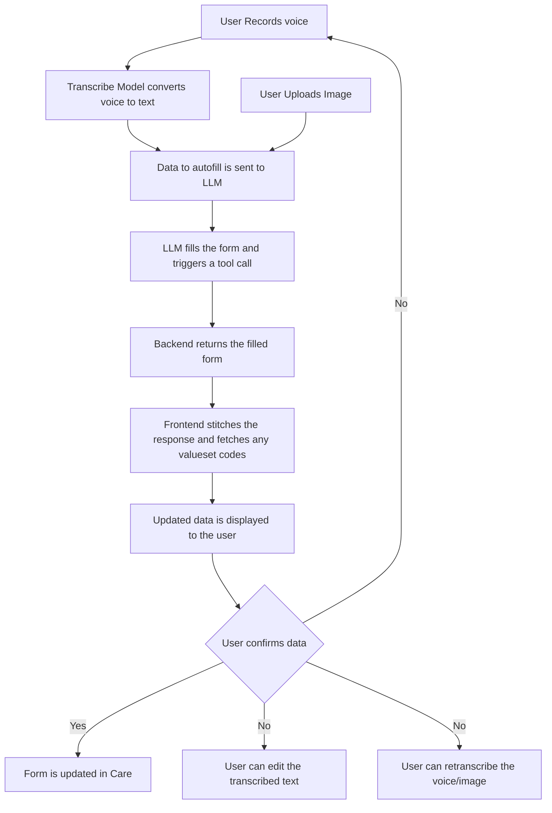

# Scribe

https://ohc.network/care-scribe

Care Scribe is an AI powered plugin integrated with Care's EMR software, designed to streamline documentation. By converting dictated information and image-based inputs into automatic form fills, it helps medical professionals save time and reduce errors.

Key Benefits

- Accelerated documentation process
- Enhanced accuracy through AI transcription
- Seamless integration with existing EMR workflows

<video src="https://ohc.network/illustrations/scribe.webm" playsinline autoplay muted loop controls width="600">
    <source src="https://ohc.network/illustrations/scribe.webm" type="video/webm"/>
    Your browser does not support the video tag.
</video>

## Architecture & Request Flow

At its core, Scribe acts as a bridge between a care form and an AI model—prompting the model to fill out the form using the relevant context it provides.

