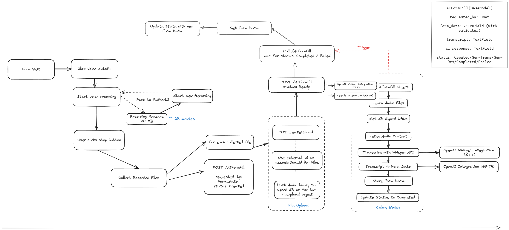

# Scribe


| Document          | Care Scribe Feature Documentation (`care_scribe`)        |
|-------------------|----------------------------------------------------------|
| **Title**         | Care Scribe Feature Overview, Integration, and Operation |
| **App Namespace** | `care_scribe`                                            |
| **Last-Modified** | 2024-05-07                                               |
| **Github-Repo**   | https://github.com/ohcnetwork/care_scribe                |
| **Created**       | 2024-04-15                                               |

## Introduction

The Care Scribe feature represents a substantial advancement in enhancing the accessibility and efficiency of form-filling applications. This introduction section will delve into the core functionalities of Care Scribe, highlighting the significant benefits it offers to users, particularly in terms of streamlining administrative processes and improving user experience. We will also explore the technology behind Care Scribe, how it integrates with existing systems, and its user interface features. Additionally, the scope of this documentation will be outlined, detailing what readers can expect to learn about the feature, including step-by-step guides, best use cases, and troubleshooting tips. This comprehensive overview aims to provide a thorough understanding of Care Scribe and its potential impact in various professional settings.

### Overview of Care Scribe

Care Scribe is an innovative feature that integrates with the Care application to enable voice-assisted form filling. Utilizing advanced speech recognition technology, Care Scribe allows users to fill out forms using voice commands. This seamless interaction aims to enhance the user experience by making form-filling faster, more accurate, and accessible.

# Table of Contents

1. [Introduction](#introduction)
   1. [Overview of Care Scribe](#overview-of-care-scribe)
   2. [Purpose and Benefits](#purpose-and-benefits)
   3. [Scope of Documentation](#scope-of-documentation)
2. [Getting Started](#getting-started)
   1. [System Requirements](#system-requirements)
   2. [Installation Guide](#installation-guide)
   3. [Initial Setup](#initial-setup)
3. [Feature Flow](#feature-flow)
   1. [High-Level Feature Operation](#high-level-feature-operation)
   2. [Detailed Flowchart Explanation](#detailed-flowchart-explanation)
4. [Scribe Integration](#scribe-integration)
   1. [Functionalities](#functionalities)
   2. [Database Migrations](#database-migrations)
   3. [API Endpoints](#api-endpoints)
   4. [Background Jobs and Scheduling](#background-jobs-and-scheduling)
   5. [Modules](#modules)
   6. [Configuring Care Scribe with AI Services](#configuring-care-scribe-with-ai-services)
5. [Frontend Integration](#frontend-integration)
   1. [Frontend Architecture Overview](#frontend-architecture-overview)
   2. [Components and State Management](#components-and-state-management)
   3. [Event Handlers](#event-handlers)
   4. [UI/UX Considerations](#uiux-considerations)
   5. [Accessibility Features](#accessibility-features)
   6. [Code Snippets](#code-snippets)
6. [Troubleshooting Guide](#troubleshooting-guide)
   1. [Common Issues and Solutions](#common-issues-and-solutions)
   2. [Logging and Error Tracking](#logging-and-error-tracking)
7. [Appendix](#appendix)
   1. [References](#references)
   2. [Acknowledgements](#acknowledgements)
8. [Changelog](#changelog)

### Purpose and Benefits

The primary purpose of Care Scribe is to streamline the data entry process within the Care application, mitigating the manual effort traditionally associated with this task. By leveraging the power of voice recognition, Care Scribe offers several benefits, including:

* **Increased Accessibility**: Makes the application more accessible to users with disabilities or those who may find typing difficult.
* **Enhanced Efficiency**: Speeds up the form-filling process, allowing users to complete forms faster than traditional methods.
* **Reduced Errors**: Improves data accuracy by reducing the likelihood of manual entry errors.
* **User Experience**: Offers a more engaging and user-friendly way to interact with the application.

### Scope of Documentation

This technical documentation is designed to provide a comprehensive guide to the Care Scribe feature. It will cover the following aspects:

* A detailed explanation of the feature flow, including a breakdown of the flowchart provided.
* An in-depth look at the backend and frontend code, including how the various functions interact and contribute to the feature's operation.
* Guidance on setting up and integrating Care Scribe into existing Care application installations.
* An overview of testing procedures and deployment strategies.
* Troubleshooting tips and maintenance practices to ensure smooth operation.

It is intended for developers, system administrators, and technical staff involved in implementing and maintaining the Care Scribe feature within the Care application.

## Getting Started

This section outlines the steps necessary to set up the Care Scribe feature within the Care application for both backend and frontend, as well as the integration of the Care Scribe plugin.

### System Requirements

To run the Care Scribe feature, the following system requirements must be met:

* Docker and Docker Compose
* Python 3.7 or higher
* PostgreSQL 10.0 or higher
* Redis
* Node.js 12.x or higher
* npm (compatible with the version of Node.js)

Ensure that your development environment meets these prerequisites before proceeding with the installation and setup.

### Installation Guide

#### Backend - Using Docker Compose

It is highly recommended to use Docker Compose for setting up the Care application, which will consist of several Docker containers: `postgres`, `care`, `redis`, `celery`, and `localstack`.

##### Steps to run the development server using Docker:

1.  To start the development environment, execute:

    ```sh
    $ make up
    ```
2.  To load dummy data for testing, run:

    ```sh
    $ make load-dummy-data
    ```
3. Access the application at [http://localhost:9000](http://localhost:9000) in your browser.
4.  To stop the development environment, use:

    ```sh
    $ make down
    ```
5.  To run tests:

    ```sh
    $ make test
    ```

#### Backend - Manual Setup

For manual setup, configure PostgreSQL and then follow the steps provided in the backend repository's documentation. This includes setting up the database, installing pre-commit hooks, and creating a superuser for the application.

##### Setting up PostgreSQL:

1. Initialize the database and set up the `postgres` user password.
2. Create a database named `care`.
3.  Run the following commands:

    ```sh
    export DATABASE_URL=postgres://postgres:<password>@127.0.0.1:5432/care
    python manage.py migrate
    python manage.py createsuperuser
    ```
4.  Use the command below to copy static files:

    ```sh
    python manage.py collectstatic
    ```
5.  To load dummy data for testing:

    ```sh
    python manage.py load_dummy_data
    ```

### Frontend Setup

To set up the frontend of the Care application, ensure that you have Node.js and npm installed, and then follow these steps:

1.  Install dependencies:

    ```sh
    npm install --legacy-peer-deps
    ```
2.  Run the app in development mode:

    ```sh
    npm run dev
    ```
3. Access  the  frontend  at  [localhost:4000](http://localhost:4000/)  in  your  browser.

### Add Care Scribe Plugin to Care Backend

1. Clone the `care_scribe` repository into the same directory as the backend.
2.  Add it to the `INSTALLED_APPS` in the backend settings by including it in the `PLUGIN_APPS`:

    ```python
    PLUGIN_APPS = manager.get_apps()
    INSTALLED_APPS = DJANGO_APPS + THIRD_PARTY_APPS + LOCAL_APPS + PLUGIN_APPS
    ```
3.  Run the plugin installation script:

    ```sh
    python install_plugins.py
    ```

### Initial Setup

Once the installation is complete, configure the environment variables, database connections, and other necessary settings as outlined in the repository's documentation for both the backend and frontend parts of the application. After configuration, ensure all services are running correctly and the application is ready for use and further development.

## Feature Flow

This section details the operational flow of the Care Scribe feature, from the initiation of voice recording to the final form submission.

### High-Level Feature Operation

Care Scribe enhances user interaction with form fields through voice commands. The feature operates by:

1. Initiating voice recording when a user visits a form and activates the 'Voice Autofill' option.
2. Stopping the recording on user command and processing the audio data.
3. Transcribing the voice recording into text and mapping the transcription to the relevant form fields.
4. Updating the form with the transcribed data and submitting it to the backend.

The process is designed to be intuitive and efficient, minimizing the need for manual text entry and reducing the potential for data entry errors.

### Detailed Flowchart Explanation



The flowchart outlines the step-by-step process of the Care Scribe feature. Below is an explanation of each step:

- **Form Visit**: The user navigates to a form within the application.
- **Click Voice Autofill**: The user initiates the voice autofill feature.
- **Start Voice Recording**: Care Scribe begins recording the user's voice inputs.
- **User Clicks Stop Button**: The user ends the voice recording session.
- **Recording Reaches 20 MB or ~23 Minutes**: The system automatically starts a new recording session to prevent data loss and ensure manageable file sizes.
- **Start New Recording**: If the initial recording session is stopped manually or reaches the file size/time limit, a new recording session begins.
- **Push to Buffer[]**: Audio data is temporarily stored in a buffer as it is being processed.
- **Collect Recorded Files**: The audio files are collected for transcription.
- **POST /scribe**: The system creates a new Scribe object with `requested_by`, `form_data`, and sets the status to 'Created'.
- **PUT CreateUpload**: Prepares the collected files for upload.
- **For Each Collected File**: Each audio file undergoes the following process:
  - **Use external_id as association_id for Files**: Links the audio files to the corresponding form instance.
  - **Post Audio binary to signed S3 URL for the FileUpload object**: Uploads the audio to a secure S3 bucket.
  - **File Upload**: Completes the file upload process.
- **Poll /AIFormFill**: The system polls for the status of the AIFormFill object to be 'Completed' or 'Failed'.
- **Get Form Data**: Retrieves the latest form data.
- **Update State with New Form Data**: Updates the application state with the new data from the form.
- **Get AIFormFill Object**: Accesses the AIFormFill object for processing.
- **Fetch Audio Files**: Retrieves the audio files associated with the AIFormFill object.
- **Get S3 Signed URLs**: Obtains secure URLs for the audio files stored in S3.
- **Fetch Audio Content**: Downloads the audio content from S3.
- **Transcribe with Whisper API**: Uses the Whisper API to transcribe audio content to text.
- **Transcript -> Form Data**: Maps the transcribed text to the appropriate form fields.
- **Store Form Data**: Saves the mapped form data.
- **Update Status to Completed**: Sets the AIFormFill object's status to 'Completed' after a successful operation.
- **Celery Worker**: An asynchronous Celery worker performs tasks such as polling the status and updating the form data.

Each of these steps represents a critical point in the operational flow of the Care Scribe feature, ensuring a seamless and efficient form-filling experience for the user.

## Scribe Integration

This section of the documentation details the integration of the Care Scribe feature into the Care application backend, describing the functionalities, database migrations, API endpoints, and background job scheduling.

### Modules

The Care Scribe feature is composed of several key components that work together to enable voice-assisted form filling. Below we will detail each module's functionality and how they interact within the system.

**Frontend Voice Recorder with Audio Size Splitting**

The voice recorder is a critical component that manages the audio input from the user. It uses the `useSegmentedRecorder` custom hook to handle the recording process. This hook facilitates the splitting of audio data into manageable chunks to prevent file size from becoming too large, which is essential for efficient data transfer and processing.

```jsx
// Example usage of useSegmentedRecorder hook
const {
  isRecording,
  startRecording,
  stopRecording,
  audioBlobs,
} = useSegmentedRecorder();
```

When the audio reaches a predefined size limit or time duration, the recorder stops the current recording session and starts a new one, ensuring seamless user experience and data integrity.

**Uploading Files to S3**

Once the audio is recorded, the files are prepared for upload. This process involves creating a signed URL for secure file transfer and then uploading the audio data to an Amazon S3 bucket. This is handled within the `Scribe` component, which interacts with backend API routes designed for file management.

```jsx
// Example of the upload function within the Scribe component
const uploadAudio = async (audioBlob, associatingId) => {
  // ...code to handle file upload to S3...
};
```

**Backend Transcription and Data Extraction Task**

On the backend, a task is triggered to process the uploaded audio files. This involves several steps:

1. **Fetching Audio Files**: Retrieving the audio files from S3.
2. **Transcription**: Using OpenAI's Whisper to convert speech to text.
3. **Data Extraction**: Applying GPT-4 Turbo to interpret the transcript and extract structured form data.
4. **Task Completion**: Updating the `Scribe` object's status to 'Completed' and storing the extracted form data.

These steps are handled by a background worker task that ensures the process is asynchronous and does not block other operations.

**Frontend Form Filling**

After the backend processing is complete, the frontend `Scribe` component receives the structured form data. It then updates the relevant form fields accordingly, providing a smooth user experience. The component listens for changes in the `Scribe` object's status and reacts by filling in the form fields when the data becomes available.

```jsx
// Example callback function to update form state
onFormUpdate={(fields) => {
  // Update form state with the new data
}};
```

**Module Interaction**

The frontend voice recorder module starts the process by capturing the user's voice and splitting the audio as needed. It then interacts with the S3 upload module to transfer the files securely. Once uploaded, the backend task takes over to transcribe and extract data from the audio files, utilizing powerful AI models. Finally, the structured form data is sent back to the frontend, where the form-filling module populates the form fields with the extracted data, completing the cycle.

By understanding the functionalities and interactions of these modules, developers can maintain, troubleshoot, and extend the Care Scribe feature as required.

### Functionalities

The Care Scribe module adds voice recognition and form autofill capabilities to the Care application. The key functionalities include:

* **Voice Recording Management**: Handling the start and stop of voice recordings, managing file buffers, and pushing audio data to storage.
* **Form Data Processing**: Collecting and structuring form data, validating it against a JSON schema, and preparing it for AI processing.
* **AI Interaction**: Integrating with AI services for transcribing audio to text and generating AI responses to fill the form data.

Key components added with this feature include:

* `Scribe`: A Django model that represents the form filling session and stores the transcription, AI response, and the status of the processing.
* `ScribeFile`: Extends the `FileUpload` model to handle specific file types associated with the Scribe feature.
* `ScribeSerializer`: Handles the serialization and deserialization of Scribe data for RESTful interaction.

### Database Migrations

The integration includes migrations to create new models in the database:

* `0001_initial.py`: This migration sets up the initial structure of the `Scribe` and `ScribeFile` models in the database.

### API Endpoints

New endpoints are added to manage the Scribe feature:

* `/api/scribe/`: Endpoints for creating, retrieving, and updating `Scribe` objects.
* `/api/scribe_file/`: Endpoints for managing the file uploads related to the `Scribe` objects.

These endpoints allow the frontend to start a form filling session, manage audio file uploads, and fetch the status and results of the AI processing.

### Background Jobs and Scheduling

To process the audio recordings asynchronously and update the form data with AI-generated responses, Care Scribe leverages Celery, a distributed task queue:

* `tasks/scribe.py`: Defines the Celery tasks for processing form fillings, such as `process_ai_form_fill`, which coordinates the AI transcription and response generation.

These tasks are queued up when a `Scribe` object's status is set to 'Ready' and are processed in the background without blocking the main application flow.

#### Pseudocode of Celery Task

Here's a simplified pseudocode representation of the Celery task for processing AI form fillings:

1. Import necessary libraries and modules.
2. Define global variable `OpenAIClient`.
3. Define function `get_openai_client` to initialize `OpenAIClient` if it's not already initialized.
4. Define two prompts for the AI model.
5. Define a shared task function `process_ai_form_fill` that takes an `external_id` as input.
    1. Filter `Scribe` objects based on `external_id` and status.
    2. Loop over each form in the filtered `Scribe` objects.
        1. If the form doesn't have any audio files, log a warning and continue to the next form.
        2. Log the start of processing for the current form.
        3. Initialize an empty list for audio file URLs and an empty string for transcript.
        4. Loop over each audio file ID in the form's audio file IDs.
            1. Get the `ScribeFile` object for the current audio file ID.
            2. Append the signed URL of the audio file to the list of audio file URLs.
            3. Log the audio file URL.
        5. Try the following steps, and if any exception occurs, log the error and set the form status to 'FAILED'.
            1. Log the start of transcript generation for the current form and set the form status to 'GENERATING_TRANSCRIPT'.
            2. If the form doesn't have a transcript, generate a transcript using the OpenAI client and save it to the form.
            3. Log the start of AI response generation for the current form and set the form status to 'GENERATING_AI_RESPONSE'.
            4. Process the transcript with the OpenAI client to generate an AI response.
            5. Log the AI response.
            6. Save the AI response to the form and set the form status to 'COMPLETED'.

The task is designed to handle various steps in the AI form filling process, including error handling to update the `Scribe` status to 'Failed' if any step encounters an issue.

## Configuring Care Scribe with AI Services

Care Scribe supports integration with both OpenAI and Azure AI services. This section provides detailed instructions on configuring the service with these providers, the differences between the configurations, and the environment variables that need to be set.

### Differences Between OpenAI and Azure AI Integration

- **API Provider**: The service can be configured to use either `OpenAI` or `Azure` as the AI backend.
- **API Endpoint**: Azure requires an additional endpoint setting (`AZURE_ENDPOINT`), whereas OpenAI uses a default endpoint set within the library.
- **API Version**: Azure integration allows specifying an API version (`AZURE_API_VERSION`), which is not required for OpenAI.
- **Model Naming**: For Azure, the model or custom deployment name is used, while OpenAI directly uses the model name provided by OpenAI.

### Required Settings Variables

The following environment variables need to be configured depending on your choice of AI service provider:

- `API_PROVIDER`: Set to either `"openai"` or `"azure"` to choose the AI service provider.
- `TRANSCRIBE_SERVICE_PROVIDER_API_KEY`: The API key for accessing transcription services from the chosen provider.
- `AZURE_API_VERSION` (only for Azure): Specifies the version of the Azure API to use.
- `AZURE_ENDPOINT` (only for Azure): Specifies the endpoint URL for Azure services.
- `AUDIO_MODEL_NAME`: The model name for audio transcription services (OpenAI) or the custom deployment name for Azure.
- `CHAT_MODEL_NAME`: The model name for chat services (OpenAI) or the custom deployment name for Azure.

### Configuration Steps

1. **Set Environment Variables**: Based on the chosen provider, set the appropriate environment variables in `plugin_settings`.

   For OpenAI:
   ```python
   plugin_settings.API_PROVIDER = 'openai'
   plugin_settings.TRANSCRIBE_SERVICE_PROVIDER_API_KEY = '<your_openai_api_key>'
   plugin_settings.AUDIO_MODEL_NAME = '<openai_audio_model_name>'
   plugin_settings.CHAT_MODEL_NAME = '<openai_chat_model_name>'
   ```

   For Azure:
   ```python
   plugin_settings.API_PROVIDER = 'azure'
   plugin_settings.TRANSCRIBE_SERVICE_PROVIDER_API_KEY = '<your_azure_api_key>'
   plugin_settings.AZURE_API_VERSION = '<api_version>'
   plugin_settings.AZURE_ENDPOINT = '<azure_endpoint>'
   plugin_settings.AUDIO_MODEL_NAME = '<azure_custom_deployment_name_for_audio>'
   plugin_settings.CHAT_MODEL_NAME = '<azure_custom_deployment_name_for_chat>'
   ```

2. **Initialize AI Client**: The AI client initialization is handled within the `get_openai_client` function, which now dynamically selects the AI service based on the `API_PROVIDER` setting.

3. **Usage in Tasks**: Use the configured AI client in your tasks to perform AI-related operations like audio transcription and chat completions, ensuring you set the model or deployment names correctly.

By following these configuration steps and setting the appropriate variables, Care Scribe will be able to interact with the chosen AI service provider efficiently and securely.

## Frontend Integration


Integrating the Care Scribe feature into the frontend involves updating the React components, state management, event handling, and ensuring the UI/UX and accessibility features are considered.

### Frontend Architecture Overview

The frontend architecture is built on React, utilizing functional components and hooks for state management. The integration of Care Scribe adds new components related to voice recording and form handling, which interact with the backend API.

### Components and State Management

New components and hooks have been introduced to manage the state of voice recording and form data:

* `Scribe.tsx`: The primary component that handles voice recording, audio data management, and interaction with the backend to post form data.
* `formDetails.ts`: Contains the metadata and schema of form fields that can be auto-filled using the Scribe feature.
* `useSegmentedRecorder.ts`: A custom hook that manages voice recording, including starting, stopping, and segmenting the audio as it's recorded.

The state of the Scribe component is managed using local state hooks like `useState` and external state management with API interactions.

### Event Handlers

Event handlers within the Scribe component control the flow of user interactions:

* Voice recording is initiated and controlled through button clicks, triggering corresponding methods in the `useSegmentedRecorder` hook.
* Form updates are handled via callbacks when the transcription process is completed and the data is ready to be filled in the form.

### UI/UX Considerations

UI updates include:

* Adding a microphone icon to indicate voice recording capability.
* Visual feedback during recording, processing, and transcription phases.
* Modals and progress indicators to enhance user feedback during the operation of the Scribe feature.

#### Code Snippets

The following snippets from the patch files demonstrate key aspects of the Scribe feature integration:

```jsx
// src/Components/Scribe/Scribe.tsx
// Example of the Scribe component initialization for the daily round form in CARE
<Scribe
  fields={DAILY_ROUND_FORM_SCRIBE_DATA} // Form field metadata
  onFormUpdate={(fields) => {
    // Update form state with new fields
  }}
/>

// src/Components/Scribe/formDetails.ts
// Metadata for daily round form fields utilized by Scribe
export const DAILY_ROUND_FORM_SCRIBE_DATA: Field[] = [
  {
    friendlyName: "Temperature", // Field name
    id: "temperature", // Field ID
    type: "number", // Field type
    example: "98.6", // Example value for the field
    default: "", // Default value for the field
    description: "Enter the patient's temperature", // Field description
    options: [], // Optional: for dropdowns, checkboxes, etc.
  },
  // Additional fields...
];
```

With the frontend integration complete, the application provides a seamless and accessible form-filling experience, leveraging voice-to-text technology to enhance user interaction with the Care platform.

### Troubleshooting Guide

#### Common Issues and Solutions

Here's  a  list  of  potential  problems  users  might  encounter  while  using  the  Care  Scribe  feature,  along  with  solutions  to  address  them:

**Issue:**  Voice  recording  fails  to  start.
**Solution:**
-   Ensure  that  the  user  has  granted  microphone  access  to  the  browser.
-   Verify  that  the  microphone  is  functioning  correctly  and  is  not  being  used  by  another  application.
-   Check  the  browser  console  for  any  error  messages  related  to  audio  capture.
    
**Issue:**  Transcription  accuracy  is  low.
**Solution:**
-   Speak  clearly  and  at  a  moderate  pace  during  the  recording.
-   Avoid  background  noise  that  might  interfere  with  the  audio  capture.
-   Consider  using  a  higher-quality  microphone  for  better  audio  input.

**Issue:**  Form  data  is  not  mapped  correctly  to  the  fields.
**Solution:**
-   Review  the  form  field  metadata  in  formDetails.ts  to  ensure  the  friendlyName  and  id  attributes  are  accurate  and  match  the  form  structure.
-   Check  the  transcript  for  any  errors  or  inconsistencies  that  might  cause  misinterpretation  during  the  data  extraction  process.

**Issue:**  AI  response  generation  is  taking  too  long.
**Solution:**
-   Verify  that  the  backend  task  queue  is  running  and  processing  tasks  efficiently.
-   Check  the  performance  of  the  AI  service  and  ensure  it  is  responding  within  acceptable  timeframes.
-   Consider  optimizing  the  AI  prompts  and  data  structures  to  improve  the  response  time.

#### Logging and Error Tracking

Care  Scribe  utilizes  logging  mechanisms  to  record  events  and  errors  during  the  operation  of  the  feature:

-   **Frontend  Logging:**  The  Scribe  component  logs  events  and  errors  to  the  browser  console  using  the  console.log  and  console.error  methods.
    
-   **Backend  Logging:**  The  Django  application  logs  events  and  errors  to  the  server  logs  using  the  Python  logging  module.
    

Sentry.io is utilized for error tracking and capturing errors from both the frontend and the backend loggers, offering real-time monitoring and reporting of errors. This provides valuable insights into potential issues and areas that require improvement.

### Appendix

#### Code Snippets

Here are some code snippets demonstrating key aspects of the Care Scribe implementation:

Frontend Voice Recorder Initialization:
```
// Example of initializing the voice recorder with the useSegmentedRecorder hook
const {
  isRecording,
  startRecording,
  stopRecording,
  audioBlobs,
} = useSegmentedRecorder({
  onNewBlob: handleNewAudioBlob,
  maxBlobDuration: 23 * 60 * 1000, // 23 minutes in milliseconds
  maxBlobSize: 20 * 1024 * 1024, // 20 MB in bytes
});
```

Backend Celery Task for AI Form Fill:
```
@shared_task
def process_ai_form_fill(external_id):
    scribe_obj = Scribe.objects.get(external_id=external_id)
    # ...code to process the audio files and generate the AI response...
    scribe_obj.status = 'Completed'
    scribe_obj.ai_response = ai_response
    scribe_obj.save()
```

Form Field Metadata Example:
```
// Example of form field metadata for the Scribe feature
export const DAILY_ROUND_FORM_SCRIBE_DATA: Field[] = [
  {
    friendlyName: "Temperature",
    id: "temperature",
    type: "number",
    example: "98.6",
    // Other field attributes...
  },
  // Additional fields...
];
```
These snippets provide a glimpse into the inner workings of the Care Scribe feature and can be helpful for understanding its implementation details.

#### References

- OpenAI Whisper: https://openai.com/blog/whisper/
- GPT-4: https://openai.com/research/gpt-4
- GPT-4 Turbo: https://platform.openai.com/docs/models/gpt-4-turbo-and-gpt-4
- Django: https://www.djangoproject.com/
- React: https://reactjs.org/
- Celery: https://docs.celeryproject.org/en/stable/

#### Acknowledgements

- OpenAI for providing the Whisper and GPT-4 AI models that power the Care Scribe feature.
- The Django and React communities for developing and maintaining the frameworks used in the Care application.
- The Celery project for providing the distributed task queue system used for asynchronous processing.

### Changelog

- **2024-04-15**: Initial draft of the Care Scribe Technical Documentation.
- **2024-05-07**: Fixes to the flowchart, Add details on Celery task, and revise Accessibility and Dependencies.
