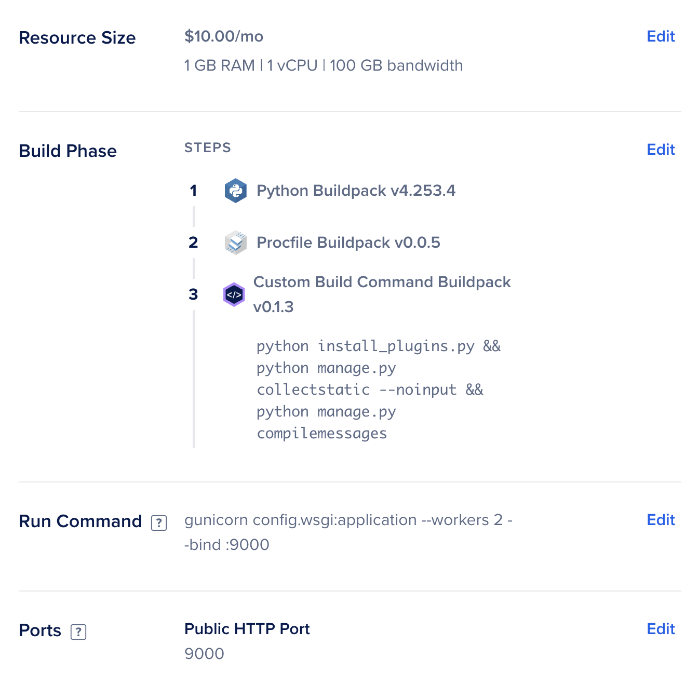

import JwksGenerator from '@site/src/components/JwksGenerator';

# Deploying Care on DigitalOcean

In this guide, we’ll walk you through deploying **Care**, on **DigitalOcean**. We’ll keep things simple & you can simply follow along to get your instance up and running. Expect the process to take about **an hour**, depending on your familiarity with the tools.

---

### **Prerequisites**
- A DigitalOcean account ([Sign up here](https://www.digitalocean.com)).
- A fork of the Care backend and frontend repositories.
- A registered domain name (optional but recommended).
- Basic familiarity with DigitalOcean's App Platform and Spaces.

---

### **What You’ll Be Doing**

We’ll guide you step by step to:
- Set up a **PostgreSQL database** for secure data storage.
- Configure **DigitalOcean Spaces** for handling files and media.
- Deploy the **Care backend** with Redis and Celery for task management.
- Set up the **Care frontend** for users to access.
- Secure the setup with custom domains, API keys, and SSL.
- Setup a CI/CD Pipeline for Continuous Deployment

---

### **Ready to Start?**

Grab a coffee and prepare to bring your Care application to life on DigitalOcean. Let’s dive in! 🌟

---

## **Step 1: Create the Database**

1. **Navigate to Databases:**
   - Log in to DigitalOcean and go to the **Databases** section.

2. **Create a PostgreSQL Database:**
   - Click **Create Database**.
   - Choose the following:
     - **Region**: Select the nearest data center.
     - **Engine**: PostgreSQL (Version 16).
     - **Resources**: Select a plan based on your requirements.
        
     - **Name**: Give your database a unique name.
     - **Tags**: Add tags for organization.
        


3. **Save Connection Details:**
   - Once the database is created, note the connection URL for later use.


---

## **Step 2: Set Up Object Storage (Spaces)**

1. **Navigate to Spaces:**
   - Go to the **Spaces** section in DigitalOcean.

2. **Create a New Space:**
   - Click **Create a Space**.

   - Choose:
     - **Region**: Select the same region as your database.
     - **Enable CDN**: For faster file delivery.
     - **Bucket Name**: Enter a unique name.
     - **Project**: Select the default project. 
     - **Create**: Click to `Create a Spaces Bucket` create the space.


3. **Generate API Keys:**
   - Go to the **API** tab and click **Spaces Keys**.
   - Create a new key pair and save the **Key** and **Secret**.


---

## **Step 3: Deploy the Care Backend (BE)**

### **Step 3.1: Deploy Redis**
1. **Set Up Redis:**
   - Go to the App Platform and click **Create App**.
     
   - Choose **Docker Hub** as the source and use:
     - **Repository**: `redis/redis-stack-server`.
     - **Tag**: `6.2.6-v10`.
     - **Port**: Expose `6379` as an internal port.
   - Name the component `redis`. 
     
     
2. **Name and Deploy:**
   - Name the App `care-backend` and deploy it.
     

---

### **Step 3.2: Deploy the Care Backend**
1. **Fork and Clone the Repository:**
   - Fork the [Care Backend Repository](https://github.com/ohcnetwork/care).
   - Use the `production` branch for deployment.

2. **Set Up the App:**
   - Click **Create App** and choose **From Source Code**.
   - Select your forked repo and branch.
   - Set the build and run commands:
     
     
     - **Build Command:**
       ```bash
       python install_plugins.py && python manage.py collectstatic --noinput && python manage.py compilemessages
       ```
     - **Run Command:**
       ```bash
       gunicorn config.wsgi:application --workers 2 --bind :9000
       ```
     
3. **Environment Variables:**
   - Add the following as global environment variables:
     ```bash
     DJANGO_SETTINGS_MODULE=config.settings.production
     DATABASE_URL=<db-url> # Use the connection URL from Step 1.
     REDIS_URL=redis://redis:6379
     CORS_ALLOWED_ORIGINS=["https://care.example.com","http://localhost:4000"","http://127.0.0.1:4000"]
     CELERY_BROKER_URL=redis://redis:6379
     REDIS_URL=redis://redis:6379
     BUCKET_PROVIDER=DIGITAL_OCEAN
     BUCKET_REGION=nyc3 # Use the region of your Spaces.
     BUCKET_KEY=  # Use the Spaces key.
     BUCKET_SECRET= # Use the Spaces secret.
     BUCKET_HAS_FINE_ACL=True
     FILE_UPLOAD_BUCKET=example-space-ohc # Use the name of your Space.
     FILE_UPLOAD_BUCKET_ENDPOINT=https://example-space-ohc.nyc3.digitaloceanspaces.com
     FACILITY_S3_BUCKET=example-space-ohc # Use the name of your Space.
     FACILITY_S3_BUCKET_ENDPOINT=https://example-space-ohc.nyc3.digitaloceanspaces.com
     JWKS_BASE64= # Add your JWKS key. (Refer to the next section to create one.)
     DISABLE_COLLECTSTATIC=1
     ```

#### Generate JWKS Key
<JwksGenerator />

     
4. **Expose Ports:**
   - Expose `9000` for public HTTP access.

---

### **Step 3.3: Add a Domain for the Backend**
1. **Configure Domain:**
   - Go to the app settings and add your domain (e.g., `care-api.example.com`).
   - Update your DNS provider with the CNAME record.

     

---

### **Step 3.4: Set Up Celery Worker and Beat**
1. **Celery Worker:**
   - Create a new component in the app.
   - Use:
     - **Run Command:**
       ```bash
       celery --app=config.celery_app worker --max-tasks-per-child=6 -B --loglevel=info
       ```
     
     
    
2. **Celery Beat:**
   - Create another component with:
     - **Run Command:**
       ```bash
       python manage.py migrate && python manage.py load_redis_index
       ```
     
     
---

## **Step 4: Deploy the Care Frontend (FE)**

1. **Fork the Frontend Repo:**
   - Fork the [Care Frontend Repository](https://github.com/ohcnetwork/care_fe).
   - Use the `production` branch.

2. **Set Up the App:**
   - Click **Create App** and configure:
     - **Type**: Static Site.
     - **Build Command:** `npm run build`.
     - **Environment Variable:**
       ```bash
       REACT_APP_API_URL=https://care-api.example.com
       ```
     - **Output Directory:** Auto.

3. **Add Domain:**
   - Go to app settings and add the frontend domain (e.g., `care.example.com`).


     
     
     

---

## **Step 5: Secure Database Access**

1. **Restrict Access:**
   - Navigate to the Database settings.
   - Add the Care backend app as a trusted source.

     

---

## **Step 6: Configure CORS for Spaces**

1. **Go to Bucket Settings:**
   - Open your bucket in Spaces.
   - Add the following CORS configuration:
     ```json
     [
       {
         "AllowedHeaders": ["*"],
         "AllowedMethods": ["GET", "POST", "PUT", "DELETE"],
         "AllowedOrigins": ["https://example.com"],
         "ExposeHeaders": []
       }
     ]
     ```

     

---

## **Final Steps**

- **Verify Deployment:**
  - Test the backend and frontend by accessing the respective domains.
  - Ensure all components (Redis, Celery Worker, Beat) are running.

- **Optimize Security:**
  - Use SSL certificates (e.g., Let’s Encrypt) to enable HTTPS.
  - Configure firewall rules to restrict access.


     
     
---

## **Conclusion**

You’ve successfully deployed the Care application on DigitalOcean! With the database, object storage, backend, and frontend configured, your application is ready for use. 🚀

For troubleshooting, feel free to join our Community on Slack at [slack.ohc.network](https://slack.ohc.network); You may also refer to the official [DigitalOcean Documentation](https://www.digitalocean.com/docs) for anything question about Digital Ocean
