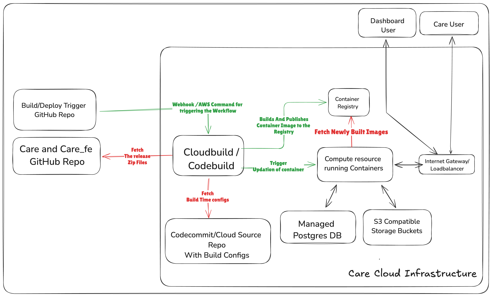

# Deploy Care

## Overview
Care can be deployed on any cloud provider provided at different scale. The generic requirements for deploying Care are:

1. **Compute Resources**
   - High Availability Kubernetes Cluster
     - Multi-master setup for fault tolerance.
     - Worker nodes distributed across multiple geographic locations.
     - Custom Horizontal Pod Autoscalers (HPAs) based on various metrics.
     - Cluster Autoscaler for dynamic adjustment of worker nodes.
     - Support for Custom Resource Definitions (CRDs) for extended functionality.
     - Fine-grained Role-Based Access Control (RBAC) policies.
     - Strict security policies including PodSecurityPolicies and Network Policies.
     - Advanced ingress controllers with features like header rewriting and SSL termination.
   - Virtual Private Server (VPS) such as DigitalOcean Droplet, AWS EC2, GCP Compute Engine, etc.
     - Customizable virtual machines with dedicated resources.
     - Should be running a standard Linux distribution (x86 or ARM) such as Ubuntu or Debian and have Docker installed.
     - Backup and snapshot capabilities for disaster recovery.
   - Platform as a Service (PaaS) such as DigitalOcean App Platform, Heroku, etc.
     - Built-in support for scaling applications horizontally.
     - Integrated monitoring and logging tools.
     - Support for multiple Python Django and npm along with container images.
     - Environment variables and configuration management for application settings.
     - Secure by default with options for custom domain and SSL certificates.
2. **Highly Available Postgres Database**
   - Highly available PostgreSQL cluster with multiple read replicas for scalability and fault tolerance.
   - Support for data partitioning and sharding strategies to distribute database load across multiple nodes.
   - Support for encrypting data at rest and in transit using key management solutions.
   - Automated backup support for data consistency and reliability.
   - Automated failover mechanisms to minimize downtime.
   - Regular maintenance jobs for optimal performance.
   - Monitoring systems to ensure data consistency across replicas.
   - Procedures for database version upgrades with minimal downtime.
   - Auto-scaling policies for dynamic resource adjustment.
3. **Scalable and Secure Storage Solutions**
   - Support for highly available and scalable object storage system with S3 API compatibility.
   - Support for comprehensive data lifecycle management policies, including versioning, retention, and automatic deletion for effective data management.
   - Support for encryption for all stored objects, both at rest and in transit, to maintain data confidentiality.
   - Support for granular access controls using bucket policies, IAM roles, and access keys to restrict access to authorized users only.
4. **Network Security and Isolation**
   - Security groups for external communication.
   - Firewall rules for managing network traffic.
   - DDoS protection mechanisms to safeguard against distributed denial-of-service attacks.
   - Secure VPN service for reliable access to SSH and Kubernetes control planes.
   - Virtual Private Cloud (VPC) capabilities for creating isolated network environments.
5. **Dedicated SMTP Server**
   - Deploy and manage an SMTP server specifically designed to handle email traffic for the domain on which the cloud services are running.
   - Ensure proper configuration for email authentication.
   - Secure the SMTP server with TLS encryption for data in transit.
   - Provide detailed logging and alerting for email traffic and server health.
6. **Build and Deploy Pipelines**
 - Support for implementing image build from the release files.
 - Support for deploying the images to the Kubernetes cluster Automatically with updated images
 - Highly available private container registry for storing the images with build pipeline integration.
 - private git repository for storing infra-template and configuration files.

| Cloud Provider | Deployment Guide | Type of Deployment |
| --------------- | ---------------- | ------------- |
| AWS             | [AWS Deployment Guide](./AWS/) | Docker Setup with EC2 Instance |
| DigitalOcean    | [DigitalOcean Deployment Guide](./digitalOcean/) | Leveraging App Platform |
| GCP             | [GCP Deployment Guide](./GCP/) | Docker Setup with GCP Compute Engine |
