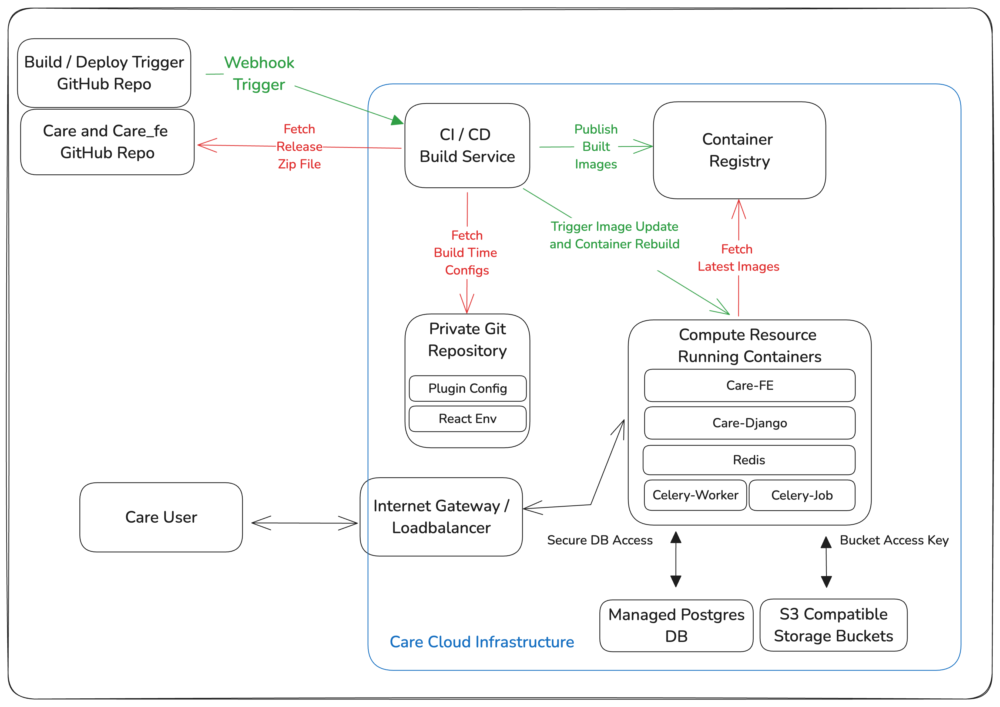

# Deploy Care

## Overview

Care can be deployed on various cloud providers with different deployment options based on your specific requirements. The generic requirements for deploying Care at different scales are outlined below. The following diagram illustrates the core infrastructure components required for a production deployment:

## Infrastructure Requirements

The following components are essential for a production deployment:

1. **Compute Resources**

   - High Availability Kubernetes Cluster (if using container orchestration)
     - Multi-master setup for fault tolerance and high availability across multiple availability zones.
     - Worker nodes distributed across multiple geographic locations for improved resilience and reduced latency.
     - Custom Horizontal Pod Autoscalers (HPAs) based on various metrics including CPU, memory, and custom application metrics.
     - Cluster Autoscaler for dynamic adjustment of worker nodes based on workload demands and resource utilization.
     - Support for Custom Resource Definitions (CRDs) for extended functionality and integration with third-party services.
     - Fine-grained Role-Based Access Control (RBAC) policies to ensure proper access management and security.
     - Strict security policies including PodSecurityPolicies and Network Policies to enforce container isolation.
     - Advanced ingress controllers with features like header rewriting, path-based routing, and SSL termination for secure client connections.
   - Virtual Private Server (VPS) options:
     - AWS EC2, GCP Compute Engine, DigitalOcean Droplet, and other similar services providing customizable virtual machines with dedicated resources.
     - Should be running a standard Linux distribution (x86 or ARM) such as Ubuntu or Debian and have Docker installed for containerization.
     - Backup and snapshot capabilities for disaster recovery and point-in-time system restoration.
   - Platform as a Service (PaaS) options:
     - DigitalOcean App Platform, Heroku, and other similar services offering simplified deployment workflows.
     - Built-in support for scaling applications horizontally to handle increased traffic and workloads.
     - Integrated monitoring and logging tools for tracking application performance and troubleshooting issues.
     - Support for multiple Python Django and npm along with container images for flexible application deployment.
     - Environment variables and configuration management for application settings without code changes.
     - Secure by default with options for custom domain and SSL certificates for encrypted communications.

2. **Database Infrastructure**

   - Highly available PostgreSQL cluster with multiple read replicas for scalability and fault tolerance across geographic regions.
   - Support for data partitioning and sharding strategies to distribute database load across multiple nodes for improved performance.
   - Support for encrypting data at rest and in transit using robust key management solutions for regulatory compliance.
   - Automated backup support for data consistency and reliability with point-in-time recovery options.
   - Automated failover mechanisms to minimize downtime during node failures or maintenance windows.
   - Regular maintenance jobs for optimal performance including vacuuming, index rebuilding, and statistics updates.
   - Monitoring systems to ensure data consistency across replicas and detect potential replication lag issues.
   - Procedures for database version upgrades with minimal downtime using blue-green deployment strategies.
   - Auto-scaling policies for dynamic resource adjustment based on query volume and database load patterns.

3. **Storage Solutions**

   - Support for highly available and scalable object storage system with S3 API compatibility for universal access methods.
   - Support for comprehensive data lifecycle management policies, including versioning, retention, and automatic deletion for effective data management and cost optimization.
   - Support for encryption for all stored objects, both at rest and in transit, to maintain data confidentiality and meet compliance requirements.
   - Support for granular access controls using bucket policies, IAM roles, and access keys to restrict access to authorized users only and prevent unauthorized data access.

4. **Network Security**

   - Security groups for external communication with fine-grained rule management for incoming and outgoing traffic.
   - Firewall rules for managing network traffic between different tiers of the application architecture.
   - DDoS protection mechanisms to safeguard against distributed denial-of-service attacks and ensure service availability.
   - Secure VPN service for reliable access to SSH and Kubernetes control planes with multi-factor authentication.
   - Virtual Private Cloud (VPC) capabilities for creating isolated network environments with private subnets for sensitive components.

5. **Email Infrastructure**

   - Dedicated SMTP server specifically designed to handle email traffic for the domain on which the cloud services are running.
   - Ensure proper configuration for email authentication including SPF, DKIM, and DMARC to prevent spoofing.
   - Secure the SMTP server with TLS encryption for data in transit to protect sensitive information.
   - Provide detailed logging and alerting for email traffic and server health to monitor delivery rates and detect issues.

6. **CI/CD Pipeline**
   - Support for implementing image builds from the release files with automated testing and validation.
   - Support for deploying the images to the Kubernetes cluster automatically with updated images and rollback capabilities.
   - Highly available private container registry for storing the images with build pipeline integration and vulnerability scanning.
   - Private Git repository for storing infrastructure templates and configuration files with proper access controls and audit logging.

## Getting Started

1. Select your preferred cloud provider from the options below
2. Follow the specific deployment guide for your chosen provider
3. Deploy and configure your application according to the infrastructure requirements

## Available Cloud Providers

| Cloud Provider | Deployment Guide                                 | Available Options |
| -------------- | ------------------------------------------------ | ----------------- |
| AWS            | [AWS Deployment Guide](./AWS/)                   | EC2, ECS          |
| DigitalOcean   | [DigitalOcean Deployment Guide](./digitalOcean/) | App Platform      |
| GCP            | [GCP Deployment Guide](./GCP/)                   | GCS, GKE          |
